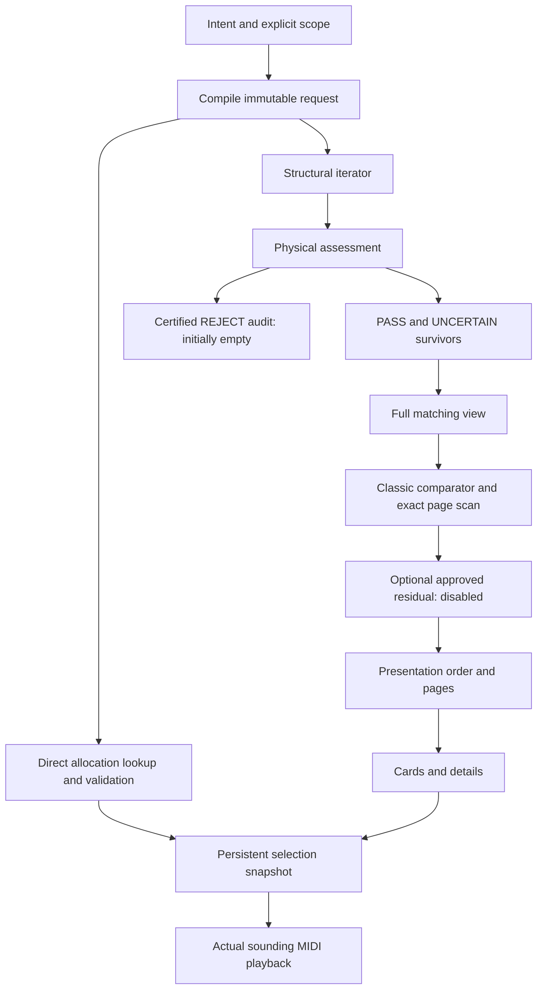

# Final Engine Specification

Status: **IMPLEMENTED as `guitar-engine/2`; RELEASE-GATE GO.** Stage 10 retired the superseded compatibility paths after verifying that they had no legitimate callers. The layer contracts and policy decisions below remain authoritative.

Rollout gates are limited to correctness, layer-contract invariants, browser/performance, accessibility, and truthful uncertainty presentation. The five-player task check is future formative validation, not a rollout prerequisite. Without appropriate human validation, claims of improved preference, human playability or comfort are prohibited; passing engineering gates does not authorize those claims.

Design baseline: `guitar-engine/1`; integrated production version: `guitar-engine/2`. Adjudicated 2026-09-13 against production baseline `a79007f0919b5b7f34657caa99f6d30a787c2a49`. Historical source mappings and migration requirements describe the cutover that produced v2; after Stage 10 they are not active compatibility APIs. MUST/SHALL express the preserved engine contracts; numerical resource targets are engineering budgets, not measured results.

## 1. Executive architecture decision

Implement **request compilation → structural enumeration → physical assessment → deterministic ordering → presentation and pagination**. Physical survivors are every PASS and UNCERTAIN allocation. Initially there are **no enabled production REJECT rules**. The existing group and reach cutoffs become cumulative uncertainty evidence. The explicit physical solver and all empirical ranking remain offline.

The engine's mathematical result is a finite set of complete string allocations under an explicit harmonic request. Its observable ordering is a full deterministic permutation, which may be evaluated lazily. Neither a UI prefix nor an in-memory cache defines that set. Every survivor is reachable by stable pagination and direct identity lookup, even when exhaustive scans must be repeated to stay within memory budgets.

Adopt a versioned `classic-v1` deterministic policy: retain the established musical and ergonomic preference formulas, isolate their legacy feature definitions, remove validity sentinels and tradeable slash compliance, replace incidental tie-breaks with numeric allocation order, and expose every contribution. This is an explicitly selected product preference for the current first-voicing/exploration task, not an optimality or comfort claim. The frozen five-term alternative has not earned promotion. Do not silently simplify the scorer while expanding its input distribution.

Keep the current standalone default (root and at least three distinct formula pitch classes, capped by formula size), and accompaniment default (root optional, at least two). Add an explicit partial-realization contract; do not make arbitrary partials the first-play default. Separate formula vocabulary from required realization tones. Correct two semantic issues: dominant-11 permits omission of its third without forbidding the third; diminished-7 uses `bb7`, not `6`, at the same pitch class. Arbitrary omissions never silently erase obligations.

The product remains a static six-string chord explorer. It does not certify personal playability, recognize the unique harmony of a partial shape, optimize chord transitions, or prescribe fretting fingers. SCALE/PROG behavior is outside this integration except for shared-type compatibility and regression checks.

## 2. Authority, evidence and review method

The following inputs are frozen. This specification resolves their interface and product-policy gaps; it does not replace their findings.

| ID | Frozen source | SHA-256 read for this specification |
|---|---|---|
| G | [Generator review](../research/generator-scope/review.md) | `706b34e683d1a3415c61fae332d379e975ff99a3407893e7d362343f75e7774e` |
| P | [Physical review](../research/physical-layer-review/review.md) | `c7ae4d4151e2f2ea38562a0fe53c6c34c976aed466cbea280fe27ca26f2fb12e` |
| R | [Ranking decision](../../.research/empirical-ranking-review/decision.md) | `72f38baba30c99ee0ed9b9e580a55b9d03ed77196bac5b8cf0a40baf58cd5ba4` |
| A | [Current ranking audit](../research/empirical-ranking-current-audit.md) | `f2eaf8477565dd2ed408966f518fd860f92fd9f2b5264cc744674a1b93444724` |

Source reconstruction used the current registry, semantics, generator, descriptors, geometry, ranking, exploration, workers, selection/audio adapters and their tests. [Product contract](../chord-exploration.md) establishes first playback, comparison, full-pool filtering and stable selection as the product objective. Its old physical/monotonic scope and frozen-weight instructions are superseded only where this specification explicitly says so. README's description of generation “from physics” must be corrected during implementation. No AGENTS.md was found in the project or its checked parent locations. Existing untracked research and private artifacts are inputs, not disposable working files.

Evidence labels used below: **F** established mathematical/representation fact; **H** engineering or physical heuristic; **C** context-specific musical convention; **PP** product policy; **E** empirical observation; **U** unsupported assumption. A source describing a musical practice does not prove its necessity in every style.

Additional evidence consulted on 2026-09-13:

| ID | Primary/authoritative source | Material contribution and limit |
|---|---|---|
| M1 | Megan Lavengood, [Jazz Voicings, Open Music Theory](https://viva.pressbooks.pub/openmusictheory/chapter/jazz-voicings/) | Root omission with a bassist, fifth omission and contextual spacing/doubling conventions. These are teaching guidelines, not generator axioms. |
| M2 | Bryn Hughes, [Altered and Extended Chords, Open Music Theory](https://viva.pressbooks.pub/openmusictheory/chapter/altered-and-extended-dominant-chords/) | Its classical four-voice treatment replaces the third with the eleventh. This supports permitting third omission; its other texture restrictions do not become universal rules. |
| M3 | Tonal's [chord-type data](https://github.com/tonaljs/tonal/blob/main/packages/chord-type/data.ts) | Independent implementation spells diminished seventh as `7d`; its 11 formula omits the third and its 13 formula omits the eleventh. Agreement/difference is a cross-check, not authority over product vocabulary. Pin a commit when taking implementation fixtures. |
| M4 | John Thomas/Berklee Press, [Voice Leading for Guitar excerpt](https://online.berklee.edu/takenote/voice-leading-for-guitar/) | Drop-2 is an octave displacement within a close voicing, not merely a bass-degree predicate. Guitar practice does not establish human feasibility of every generated allocation. |
| T1 | WHATWG, [Workers](https://html.spec.whatwg.org/multipage/workers.html#dom-worker-terminate) | Messages and worker termination provide lifecycle mechanisms; termination can abort execution and discard pending tasks. A cancellation acknowledgement cannot be assumed after termination. |
| T2 | WHATWG, [Structured data](https://html.spec.whatwg.org/multipage/structured-data.html#transferable-objects), and [MDN transferable objects](https://developer.mozilla.org/en-US/docs/Web/API/Web_Workers_API/Transferable_objects) | Transfer moves buffer ownership; it does not make an arbitrarily large object graph cheap to construct or render. |
| T3 | TC39, [Number exponentiation](https://tc39.es/ecma262/multipage/ecmascript-data-types-and-values.html#sec-numeric-types-number-exponentiate) | Exponentiation permits implementation approximation. Explicit numeric policy is required for cross-browser exact ordering. |

The [certified evidence audit](../../.research/empirical-ranking-review/evidence-audit.md) and [frozen experiment results](../../.research/empirical-ranking-review/experiment-results.md) were consulted as underlying ranking evidence. No holdout was consumed, solver rerun, corpus fit, new preference study or generator census performed. Research stopped after the material musical ambiguities and execution mechanisms were resolved. Additional general guitar examples would not determine weights or establish physical certificates.

### Contradictions requiring integration changes

1. Generator's `playable:true`, exploration's rejection exception and ranking's `-500` sentinel cannot represent P's survivors. Replace the types and boundary checks together; do not encode UNCERTAIN as false.
2. Required tones are currently intersected with style vocabulary while descriptors and ranking reapply a different required set. Compile one immutable realization contract; descriptors report both omissions and request satisfaction.
3. Bass-only drop routes cannot truthfully claim full drop voicings. Preserve them only through explicitly named compatibility semantics, and give genuine drop subsets exact pitch predicates.
4. A full permutation does not require a full object array. Repeated exact scans reconcile R's conservation with G's much larger universe.
5. Physical review instructions to leave ranking unchanged governed that layer study. R expressly calls for separately adjudicated deterministic refinement. This document's isolated scorer changes are that adjudication; none relax P's evidence standard.

## 3. Independently discovered unresolved-policy inventory

This inventory was derived from the frozen boundaries, current source, tests and product goals before choosing musical examples or policies. IDs are used throughout the specification.

| Decision | Discovered surface / current evidence | Final ownership/classification |
|---|---|---|
| D01 | String orientation, finite tuning/fret domain, defaults vs completeness (`tuning`, `voicingSearch`) | Explicit request plus disclosed defaults |
| D02 | Formula identity, required tones and standalone/accompaniment density (`semantics`, tests) | Versioned application realization policy |
| D03 | Omission/requirement conflicts and partial shapes (`voicingStyles`, search intersection) | Explicit request; no silent relaxation |
| D04 | Extensions, alterations, degree spelling and symbol ambiguity (`registry`, labels) | Formula metadata plus realization policy |
| D05 | Pitch-class vs voice/register constraints, duplicate pitches, recognition ambiguity | Structural facts; optional explicit predicates |
| D06 | Close/spread/drop/shell routes and descriptor names disagree | Optional subsets; truthful descriptive metadata |
| D07 | `x`, static fretting, damping, thumb, scale defaults and personalized scope | Physical profile and evidence |
| D08 | Boolean admission vs PASS/UNCERTAIN/REJECT; unsupported model operations | Physical decision policy |
| D09 | Different group estimators, full-target/thumb spans and provenance | Separate named metric versions |
| D10 | Choice of deterministic default and failed simple comparator | Deterministic product preference |
| D11 | Root/root-bass/hint stacking, context and slash conditions | Preferences vs explicit hard request |
| D12 | Muting, diagonal, density, open/position priorities and label coupling | Versioned heuristic/preference terms |
| D13 | Reproducible ties, arithmetic, score ledger and invalid input | Ranking interface/diagnostics |
| D14 | Filters vs search universe, all-open position, status filtering and precedence | View predicates before display budget |
| D15 | Selection identity, missing selections, playback, tuning/context changes | Session/selection/presentation |
| D16 | Stream vs pool, compact representation, descriptor cost and memory | Execution strategy without set change |
| D17 | Exact top pages, incomplete scans, continuation and full reachability | Ranking/pagination protocol |
| D18 | Worker lifecycle, cancellation, transport and stale responses | Browser adapter |
| D19 | Profile/version keys, bounded caches, eviction and resuming | Execution service |
| D20 | Disabled empirical hook, unsupported support and exact fallback | Optional ranking extension |
| D21 | Unsupported/empty/rejected/incomplete/fallback/malformed states | Typed cross-layer outcomes |
| D22 | Existing exports, boolean callers, styles and old IDs | Explicit compatibility/migration |
| D23 | Cross-domain consequences, feature scope and evidence not available | Out of scope or unsupported |
| D24 | Proof obligations, measurements, rollback and implementation gate | Validation and delivery policy |

## 4. Decision records

### D01 — Instrument and search domain

**Question:** What universe can a request claim to cover? **Layer/interface:** compilation → Generator. **Evidence:** G; current six-string types and high-E-first tuning (F); default fret limit is PP. **Plausible options:** fixed standard instrument; arbitrary string count; finite six-string profiles. **Decision:** support six ordered single strings in 12-EDO, arbitrary integer open MIDI values and inclusive integer fret bounds 0–36; default standard `[64,59,55,50,45,40]`, frets 0–15. Index 0 remains physical string 1, regardless of pitch order. Hardware max fret and requested domains are explicit. **Rationale:** alternate/re-entrant tuning needs no new representation, while new string counts would expand UI and complexity. **Confidence:** High. **Reversibility:** Medium; larger domains change codec/capability version, not harmonic or physical validity.

### D02 — Standalone, accompaniment and density

**Question:** What does selecting a chord ask the guitar to sound? **Layer/interface:** request policy. **Evidence:** G leaves these choices open; product first-play goal; M1's contextual root omission (C); current tests (implementation evidence). **Plausible options:** every nonempty tone subset; full formula only; declared identity obligations with context defaults. **Decision:** select the third, with the exact table in §5. Standalone requires root and `min(3, formula-PC-count)` distinct PCs; accompaniment makes root optional and requires `min(2, formula-PC-count)`. Fifth omission remains available where obligations and floor permit. **Rationale:** default shapes provide useful harmonic information in isolation; accompaniment explicitly admits partial ensemble support. The three-tone floor is a visible product choice, not the definition of chord truth. **Confidence:** Medium. **Reversibility:** Medium; change policy version, counts and cache keys, never old request meaning.

### D03 — Overrides, omissions and partial realization

**Question:** May an omission weaken identity automatically? **Layer/interface:** request compiler. **Evidence:** G's silent-intersection bug; tests returning `[]` on root conflict; ambiguous partial readings (C). **Plausible options:** silently subtract requirements; prohibit all defining omissions; explicit partial contract. **Decision:** omissions restrict vocabulary; they never subtract required obligations implicitly. A `partial` request names its required tone set, allowed subset and minimum distinct PCs (default 2); the required set must be nonempty. Root requirement may be explicitly replaced. Ordinary `identity` mode may waive the default root obligation but not other defining obligations; contradictory hard inputs are rejected before enumeration. **Rationale:** supports intentional fragments without presenting them as complete or uniquely recognizable chords. No single-tone fragment UI is added. **Confidence:** High on contracts, Medium on partial default. **Reversibility:** Low for UI, Medium for serialized requests.

### D04 — Harmonic conventions and spelling

**Question:** Which apparent theory rules are policy, and which labels are wrong? **Layer/interface:** formula catalog → realization compiler. **Evidence:** M2/M3 differ from current mandatory-third 11; M3's diminished seventh spelling; registry/tests. **Plausible options:** keep all current rules; copy another dictionary; minimally correct semantics while retaining vocabulary. **Decision:** third optional for dominant-11, still allowed; `bb7` replaces `6` only in diminished-7. Keep current 13 vocabulary without natural 11, disclosed in formula details. Every explicitly named altered tone is required under identity policy; natural lower extensions are optional. All equally highest numbered extensions are required, not whichever array entry comes first. **Rationale:** supports a documented omission without forbidding existing literal voicings; spelling and pitch are distinct. These are explicit domain policies, not new exclusions justified by convention. **Confidence:** High for spelling, Medium for omission default. **Reversibility:** Medium; catalog/realization versions and degree adapters change, allocation IDs do not.

### D05 — Allocation, octave placement and interpretation

**Question:** Are doubling, crossings, extension register or unique recognition validity tests? **Layer/interface:** Generator/facts. **Evidence:** G's counterexample (F); M1's spacing recommendations (C); current recognition tests admit equivalent chord readings. **Plausible options:** implicit textbook voicing; arbitrary octave placements within request; style-specific spacing. **Decision:** allow all repeated tones, unisons, crossings, string gaps and octave placements meeting the request. Bass/top are actual min/max MIDI. Degree 9 denotes the requested harmonic role, not a compulsory pitch above the root. Exact MIDI/spacing restrictions require explicit predicates. Recognition remains a separate interpretation service and cannot veto a known request. **Rationale:** the allocation representation cannot infer unique harmonic context or preferred texture. **Confidence:** High. **Reversibility:** Low for optional predicates; changing base validity requires a new contract.

### D06 — Styles and descriptor truth

**Question:** What do shell/close/drop/spread mean? **Layer/interface:** optional subset compilation; presentation metadata. **Evidence:** G, current styles/descriptors, M4. **Plausible options:** retain misleading names; remove all styles; exact subsets with legacy translation. **Decision:** broad search is `unrestricted`. Implement exact four-voice drop subsets and close spacing as specified in §5; no new spread gate. Rename the generic required-vocabulary subset `essential-tones`; do not infer a three-tone pre-gate. Shell describes an actual third/seventh guide-tone core with optional root and compatible requested identity, not any small required set. Legacy bass-only routes get explicit adapter notices. **Rationale:** preserves available allocations while ending false structural claims. **Confidence:** High for boundaries, Medium for labels. **Reversibility:** Low for labels, Medium for old style calls.

### D07 — Physical scope and omissions

**Question:** Which playing action is assessed? **Layer/interface:** Physical input. **Evidence:** P, including separate unplayed vs required-damping fixtures; absent human validation. **Plausible options:** assume a clean strum; treat omitted strings as unplayed; require demonstrated damping. **Decision:** default is static simultaneous targets with omitted strings unplayed by the picking hand; ordinary four-finger fretting and flat-barre hypotheses, thumb disabled. Scale length defaults to 647.7 mm with `default` provenance. Damping, thumb reliance, restricted/personalized hand questions and unsupported operations are explicit and may yield UNCERTAIN. **Rationale:** avoids attributing unmodeled muting and anatomy to coordinates. **Confidence:** High. **Reversibility:** Medium; physical profile keys and evidence change, structural allocation does not.

### D08 — Physical verdicts and uncertainty

**Question:** What permits removal or a positive screen? **Layer/interface:** Physical → survivors. **Evidence:** P's frozen evidence standard. **Plausible options:** boolean gate; label everything uncertain; three-state screen. **Decision:** use P's three states verbatim in substance. PASS is a heuristic screen with no relevant warning; UNCERTAIN is retained with cumulative reasons; REJECT needs a verified exclusion covering every allowed realization. No current production rule qualifies for REJECT. Group >4, span >95 mm, former >5/>180 severe flags, unsupported demanded operations and thumb reliance are UNCERTAIN. **Rationale:** neither failed search nor inherited cutoff proves impossibility. **Confidence:** High. **Reversibility:** Low for adding qualified evidence, High for changing verdict meaning (forbidden under v1).

### D09 — Metric provenance

**Question:** Must ranking and assessment share a finger number? **Layer/interface:** facts/Physical/Ranking. **Evidence:** P/A show a partial-barre shape counted as 3 vs 5. **Plausible options:** silently unify; pretend equal; preserve distinct named estimates. **Decision:** Physical uses `partial-cover-v1`; `classic-v1` uses `whole-fret-groups-v1`. Compute each once when needed, with scale and operation provenance; do not call either actual required fingers. Report full-target and thumb-excluded spans separately. **Rationale:** honest provenance removes contradiction without smuggling a scorer change into a helper refactor. **Confidence:** High. **Reversibility:** Medium; replacing the ranking metric requires a new rank version and protected comparison.

### D10 — Deterministic baseline

**Question:** Which ordering should integrated implementation target? **Layer/interface:** Ranking. **Evidence:** R/A and frozen experiment: simple is an unvalidated control with substantial retrieval losses, not a promoted alternative; existing functional tests and first-play objective. **Plausible options:** arbitrary identity order; five-term replacement; audited established priorities. **Decision:** `classic-v1` (§7), with contract corrections and full ledger. Retain simple offline. **Rationale:** compact finger estimates, familiar rooted/open forms and ringing textures are defensible preferences for an initial general guitar choice, while full-pool conditions support other tasks. Existing evidence argues against removing their combined utility on simplicity alone. None of the exact coefficients is calibrated; expanded-pool utility remains a future validation question, not a current rollout prerequisite. **Confidence:** Medium. **Reversibility:** Low; rank version and cache only, no candidate membership.

### D11 — Bass, roots and accompaniment

**Question:** Which harmonic priorities are requirements? **Layer/interface:** request/view vs Ranking. **Evidence:** finite slash penalties are tradeable (F); A's 42-point root stack; M1 contextual practice (C). **Plausible options:** hard root-position default; context-tuned new weights; existing rooted preference with exact constraints. **Decision:** slash bass and explicitly selected bass/top/root conditions are predicates, never score penalties. Allow formula-tone slash bass initially; non-formula slash bass is unsupported. Keep root presence/hint/bass terms in `classic-v1` for both contexts, with the compound effect disclosed. Accompaniment broadens admission; it does not imply a request for rootless-first ordering. **Rationale:** separates “include accompaniment shapes” from a different preference objective; explicit root omit must work regardless of score. **Confidence:** Medium. **Reversibility:** Low for rank priorities, Medium for non-formula slash extension.

### D12 — Ergonomic and texture preferences

**Question:** What happens to all remaining legacy terms? **Layer/interface:** Ranking. **Evidence:** A classifies them as H/C/PP with unsupported numeric calibration; historical diagonal/core-mute preferences; R does not establish a superior replacement. **Plausible options:** delete all uncalibrated terms; invent new weights; preserve and expose a versioned policy. **Decision:** retain the precise terms in §7, including diagonal and core-string mute priorities. Freeze their input predicates independently of UI labels. The “barre” term measures grouped contacts, muting terms measure topology, and position/fullness terms express convention. No new crossing, dissonance, register or UNCERTAIN penalty. **Rationale:** respects task preferences while making their cumulative tradeoffs reviewable; neutral classification changes cannot accidentally rescore a shape. **Confidence:** Medium overall, Low for any coefficient's optimality. **Reversibility:** Low via a separately evaluated ranking version.

### D13 — Ledger and reproducibility

**Question:** How can two executions agree and explain the order? **Layer/interface:** Ranking → Presentation. **Evidence:** A's locale/route ties, missing contributions and sentinel; T3. **Plausible options:** raw floats/locale ties; rounded final score; specified integer numeric policy. **Decision:** exact integer score key with declared geometry quantization (§7), numeric high-E-first state-vector tie, no physical-status tie. Ledger includes every term, including zero/inactive terms on detail request. Invalid candidates cause contract failure, not a bad score. **Rationale:** reproducibility must include feature arithmetic and IDs, not only fixed weights. **Confidence:** High. **Reversibility:** Medium; numeric version changes invalidate score/cursor caches.

### D14 — Conditions and views

**Question:** What may a filter hide, and when? **Layer/interface:** survivors → matching view. **Evidence:** current tests/product contract and R. **Plausible options:** filter displayed top K; mutate base request; evaluate predicates over full survivors. **Decision:** full-survivor predicates, default including PASS and UNCERTAIN; no status filter in first-release UI. A future explicit PASS-only view must be labelled “screen passes only,” retain counts and clearability. All-open shapes have null stopped position and match only an unconstrained stopped-position view (§8). No condition silently switches context. **Rationale:** every match remains discoverable and a fret slider should not advertise all-open shapes as situated high on the neck. **Confidence:** High. **Reversibility:** Low for controls, Medium for predicate semantics/version.

### D15 — Selection and audio

**Question:** Does reordering or filtering replace the selected shape? **Layer/interface:** session/UI/audio. **Evidence:** current identity/playback/race tests and product contract. **Plausible options:** select first visible after every change; stable allocation selection; retain stale interpretation forever. **Decision:** retain selection by allocation within a compatible request, independently of the current page/filter; validate it directly after context changes. Root/quality changes reset selection and filters. Tuning changes cannot reuse the old identity. Never substitute a formula for actual selected pitches. **Rationale:** selection is a user's decision, and pitch doubling/octaves are audible identity. **Confidence:** High. **Reversibility:** Low for interaction policy; allocation identity is a stable contract.

### D16 — Materialization and memory

**Question:** Must the entire universe become objects? **Layer/interface:** execution service. **Evidence:** G's 8.59× count expansion, unmeasured browser costs; representation facts (F). **Plausible options:** eager object graph; only retain top K; compact cached scan with exact replay fallback. **Decision:** the third, with §9 budgets. Generator emits reusable compact rows; full descriptors/evidence prose are lazy. Store the complete compact pool only if it fits the declared budget. Otherwise enumerate again for exact pages and direct lookup. **Rationale:** bounded memory and completeness are compatible if CPU work can repeat. **Confidence:** High on correctness, Medium on target latency. **Reversibility:** Low; storage strategies may change without observable set/order changes.

### D17 — Pagination and incomplete computation

**Question:** When is a page globally ranked and how is its tail reached? **Layer/interface:** ranking session. **Evidence:** G/R full-set contracts; exact top-K algorithms (F). **Plausible options:** first K found; beam truncation; full scan per bounded page or cached exact index. **Decision:** publish an exact page only after exhaustive scan for that view; retain K best matches after a stable cursor, count all matches, and repeat for the next page. Partial results are labelled provisional and cannot issue exact cursors or exact zero counts. **Rationale:** a bounded heap alone does not imply omitted candidates are invalid. **Confidence:** High. **Reversibility:** Low for algorithms, Medium for cursor schema.

### D18 — Workers and cancellation

**Question:** How does the UI remain responsive and ignore old work? **Layer/interface:** browser adapter. **Evidence:** current whole-pool worker and T1/T2. **Plausible options:** main-thread generation; clone every result; persistent worker session with bounded messages. **Decision:** one active worker, task-yielded batches, session/request/view IDs on every message, explicit cancellation and termination fallback, only pages/details cross the boundary. No synchronous main-thread fallback. **Rationale:** controls/selection must stay responsive during long scans; stale work must not update notes or totals. **Confidence:** High. **Reversibility:** Low if protocol semantics remain stable.

### D19 — Caches and resumability

**Question:** What makes reuse safe? **Layer/interface:** execution. **Evidence:** P's profile mismatch, R's exact fallback, observed current default reassessment. **Plausible options:** tab-only cache; monolithic full-session cache; layered versioned keys and replay. **Decision:** allocation set, physical, feature/rank and view caches have distinct keys (§9). Cache misses/eviction trigger exact recomputation. No persistent database is required. Interrupted scans checkpoint iterator and accumulator only while available; otherwise replay honestly. **Rationale:** same notes on a new physical profile cannot inherit an old verdict, while a filter need not recompile harmony. **Confidence:** High. **Reversibility:** Low; cache design is not product validity.

### D20 — Empirical extension

**Question:** Is any empirical runtime behavior justified? **Layer/interface:** optional Ranking extension. **Evidence:** frozen R and protected regressions. **Plausible options:** deploy marginal priors; diagnostic-only; unbounded future plugin. **Decision:** offline-only now, runtime switch false and no corpus bundle/import. Future extension must meet §10, with whole-query exact deterministic fallback. **Rationale:** new upstream distributions weaken, rather than repair, the existing generalization evidence. No genuinely new empirical evidence was discovered here. **Confidence:** High. **Reversibility:** Medium; activation requires evidence and a versioned policy review, not a toggle alone.

### D21 — Failure semantics

**Question:** Which failures can safely look empty or fall back? **Layer/interface:** all boundaries. **Evidence:** current collapsed errors and frozen contracts. **Plausible options:** `[]`/generic error; overload physical verdict; orthogonal typed states. **Decision:** §11 distinguishes validation, unsupported capability, structural zero, no view matches, certified rejection, uncertainty, partial execution, ranking fallback and contract corruption. Only optional ranking failure may reuse exact deterministic ordering; corruption may not. **Rationale:** users must not be told no shape exists when computation did not establish that. **Confidence:** High. **Reversibility:** Medium; external protocol discriminants are versioned.

### D22 — Compatibility

**Question:** How can current callers migrate without hiding uncertainty? **Layer/interface:** adapters. **Evidence:** exports, ClientApp/bridge, worker and tests. **Plausible options:** global boolean reinterpretation; break everything immediately; explicit bounded adapters with atomic live cutover. **Decision:** §12; no producer returns a bare `ResolvedVoicing` pretending physical acceptance. Deprecated array wrappers collect complete results or return an explicit failure, never truncate. Legacy `playable` means eligible-to-display only inside a named adapter with mandatory assessment. **Rationale:** users retain selection/playback while the live API moves to proper states. **Confidence:** High. **Reversibility:** Medium; old runtime can be used for explicit rollback but is not a hidden fallback for new requests.

### D23 — Scope boundaries

**Question:** Which adjacent capabilities belong in this implementation? **Layer/interface:** capability contract. **Evidence:** frozen physical limitations, current independent Scale/Progression modules and product goals. **Plausible options:** integrate every music mode; personalized solver; static chord integration only. **Decision:** static chord integration, with alternate six-string tuning in the engine API. Capo semantics, more strings/courses, microtones, bends/harmonics, transitions, inferred fingering, non-formula slash bass, arbitrary chord parser and style-specific voice leading are unsupported/out of scope. Scale double-stop gates are documented debt, not silently changed. **Rationale:** each needs different semantics or evidence and is unnecessary to reconcile these reviews. **Confidence:** High. **Reversibility:** Medium; add capabilities without changing existing request meanings.

### D24 — Implementation and release gate

**Question:** Can work proceed, and what proves completion? **Layer/interface:** delivery. **Evidence:** frozen measurements validate old experiments only; product/player validation remains incomplete; the user's rollout-policy amendment makes the five-player check future formative validation. **Plausible options:** require a player study before rollout; ship directly; implement with bounded engineering/presentation gates. **Decision:** GO to the ordered commits in §14; rollout requires correctness, layer-contract invariants, browser/performance, accessibility and truthful uncertainty presentation checks in §13. The five-player check is not mandatory. **Rationale:** engineering readiness and evidence for human-benefit claims are separate; without appropriate human validation, improved preference, human playability and comfort claims remain prohibited. **Confidence:** High on implementation readiness, Medium on performance budgets. **Reversibility:** Low for staged rollout; architecture changes require review.

## 5. Exact request and harmonic policy

### 5.1 Compilation and precedence

Separate four objects: `SearchIntent` (what the player supplies), `ResolvedRequest` (immutable, complete search semantics), `ViewRequest` (removable conditions), and `RankPolicy` (ordering only). Defaults are not hidden hardcoded gates in Generator. Compilation returns the resolved values and their origins for details/chips.

Compilation order is normative:

1. Validate schema, catalog ID, root, instrument and capabilities. Unknown input fields are rejected rather than silently ignored. Numeric input must be finite; no modulo repair of an out-of-range root. Aliases resolve to a canonical chord ID. Every requested sounding coordinate must have MIDI in 0–127; a tuning/fret domain exceeding that codec/audio scope is unsupported, never silently clipped. The default instrument's maximum modeled fret is 15, a declared search boundary rather than a measurement of the guitar's last fret; an explicit profile may extend it through 36.
2. Instantiate the formula and identity policy, then context defaults. Preserve the formula independently of allowed/required realization tones.
3. Apply explicit overrides to named default fields (for example root requirement or minimum distinct pitch classes). An explicit value replaces a default for that field. A preset never overwrites an explicit value. Conflicting explicit values from different controls are an error, not last-write-wins.
4. Resolve `identity` or `partial` obligations, allowed-tone subset, exclusions and style predicates. Excluded required tones, an empty allowed set, `minDistinct > allowed-PC-count`, incompatible bass constraints and empty fret intervals are `conflicting-constraints`. Include field paths and values. Never intersect away a required tone to repair these cases.
5. Check harmonic prerequisites and instrument-domain reachability. A coherent request whose required tone cannot occur on the declared strings/frets is `complete/structurally-empty`, with a preflight proof when available. Instrument scarcity is different from contradictory semantics.
6. Canonicalize sorted sets, fixed field order and explicit defaults; assign request/version keys. No further layer may reinterpret context or derive a different required set.

`identity` permits adding obligations, increasing/replacing the density floor (1–6), and setting root `required|optional|excluded`. Excluding the default-required root is an explicit waiver recorded in details. It does not waive any non-root identity tone. `partial` replaces the non-root obligation set explicitly; at least one required tone is necessary, and one distinct PC requires an explicit API request. Every one-tone result, regardless of request mode, is labelled a one-tone realization, never a complete chord. The first-release UI need only expose a two-tone-or-more partial workflow. `omitDegrees` alone never implies partial mode. A stronger `complete-formula` request requires every formula tone and conflicts with exclusions.

The existing UI's root inclusion rail is a **view filter**, not an override to the search contract. Thus `standalone + view.root=omit` remains an empty view with an explicit accompaniment/partial action, preserving the current interaction. An advanced request editor may explicitly change the root obligation. This distinction must be reflected in separate field names and controls.

Allowed pitches always come from the selected catalog formula; no default scale or previously visited key supplies extra tones. V1 allows one tone token per pitch class within a formula. A future formula with aliased pitch-class roles must extend the coverage model explicitly; it may not reuse a one-bit-per-degree capacity proof unsafely.

### 5.2 Identity policy `identity-v1`

The following table is an executable acceptance fixture, not a hand-authored shape catalog. Formula degrees denote roles modulo octaves; intervals are the existing registry values, except `bb7` names interval 9 in diminished-7. The table lists **required non-root** tones; root and the distinct-PC floor are separately resolved by context/override. All formula tones remain allowed unless an explicit request excludes them.

| Catalog ID | Allowed formula vocabulary | Required non-root tones |
|---|---|---|
| major | 1, 3, 5 | 3 |
| minor | 1, b3, 5 | b3 |
| power-5 | 1, 5 | 5 |
| augmented | 1, 3, #5 | 3, #5 |
| diminished | 1, b3, b5 | b3, b5 |
| sus2 | 1, 2, 5 | 2 |
| sus4 | 1, 4, 5 | 4 |
| major-6 | 1, 3, 5, 6 | 3, 6 |
| major-7 | 1, 3, 5, 7 | 3, 7 |
| minor-7 | 1, b3, 5, b7 | b3, b7 |
| dominant-7 | 1, 3, 5, b7 | 3, b7 |
| half-diminished-7 | 1, b3, b5, b7 | b3, b5, b7 |
| diminished-7 | 1, b3, b5, bb7 | b3, b5, bb7 |
| major-9 | 1, 3, 5, 7, 9 | 3, 7, 9 |
| minor-9 | 1, b3, 5, b7, 9 | b3, b7, 9 |
| dominant-9 | 1, 3, 5, b7, 9 | 3, b7, 9 |
| dominant-11 | 1, 3, 5, b7, 9, 11 | b7, 11 |
| dominant-13 | 1, 3, 5, b7, 9, 13 | 3, b7, 13 |
| hendrix-7-sharp-9 | 1, 3, 5, b7, #9 | 3, b7, #9 |
| dominant-7-flat-9 | 1, 3, 5, b7, b9 | 3, b7, b9 |

Derive roles from formula structure and catalog semantic metadata: third/suspension; seventh (including diminished seventh); defining sixth; altered fifths; named altered extensions; highest natural extension. The sole current third-waiver condition is a major-third/dominant-seventh formula with an unaltered 11. Represent that as a semantic realization rule, not a special list of guitar shapes. Future ambiguous catalog additions require an explicit policy test rather than inheriting whatever an array loop happens to do.

Examples illustrating the contract, not privileged tuning targets:

- Default major needs root, third and three distinct formula PCs; in that vocabulary the fifth follows from the floor. Accompaniment permits the third/fifth dyad without a root. A standalone root/third dyad needs an explicit lower floor or partial request.
- Default dominant-7 needs root, third and seventh; fifth optional. Accompaniment permits its third/seventh dyad. Neither uniquely identifies the requested chord without context.
- Dominant-11 can contain or omit the third. Requesting the third explicitly restores the old obligation; excluding it selects a narrower set. No automatic “avoid-note” rejection or penalty is introduced.
- Dominant-13's shown formula excludes 11 by catalog policy; “all formula tones” means its six declared tokens, not every tone in a hypothetical complete tertian stack. Adding 11 is a future catalog capability, not silently accomplished through a style.

Formula membership/omissions and realization obligations are separate fields. `missingRequired=[]` means this resolved request was met. `omittedFormula` can still contain root or a defining tone waived under a partial request. Do not feed those omissions into an upstream-error sentinel. Labels state “rootless,” “partial,” and omitted degrees where applicable, without renaming the requested harmony. Correct C diminished-7 spelling includes B double-flat; audio still uses the same MIDI pitch as A.

### 5.3 Explicit subsets and predicates

`unrestricted` is the default. Every subset acts on the allocation's pitches, tokens or coordinates and cannot alter physical assessment or ranking policy.

- `essential-tones`: allowed vocabulary becomes the effective required set. It does not lower the density floor. A floor conflict is reported with a partial/lower-floor action; no context-blind shell pre-gate exists.
- `close-position`: for 2–6 distinct selected tone tokens, require exactly one sounding occurrence of each selected token, no others, and actual MIDI `max-min < 12`. The selected set must satisfy the resolved harmonic contract. All inversions and string allocations are admitted. This is an explicitly narrow textbook subset, not the old `close` route.
- `drop-2` / `drop-3`: require exactly four distinct selected formula tokens, including all required tokens, one sounding string per token and no extras. Enumerate every strictly ascending close-position pitch vector of those tokens with span <12 in the instrument's finite MIDI envelope; subtract 12 from its second-/third-highest pitch respectively; sort by MIDI, then match the candidate's exact token/MIDI multiset. Enumerating source pitches through `maximumSoundingMidi+12` avoids missing transformed vectors. Source inversion is unrestricted. Duplicates of the same resulting allocation merge. Four-token selection defaults to the full formula only when the formula has four tokens; otherwise the caller must supply it. Invalid cardinality is unsupported style configuration, not a silent unstyled search.
- Generic `spread` adds no predicate and is not offered as a genuine style filter. Its deprecated API value maps to `unrestricted` with a notice. Broad allocations may carry factual total pitch span and stopped/string spans; those facts alone do not prove a drop style.
- A `shell` descriptor requires only a third plus seventh-function core (or third plus defining sixth), with optional root, no other distinct tones, and at most one additional doubling. A shell **subset** cannot omit a required extension/alteration unless the request explicitly selects partial semantics. Essential-tone augmented/suspended/extended shapes are not automatically called shells.

Other supported hard/view predicates: exact sounding-string count 1–6; exact or allowed string set; open require/exclude; root include/omit; complete formula/at least one omission; bass/top token or pitch class or exact MIDI; and a stopped-fret interval. Conditions on the same property intersect. Slash bass uses the actual minimum sounding pitch's PC and requires a formula token in v1. Tied bass/top unisons retain every contributing string; a deterministic representative string for legacy features is the largest string index. No inversion label encodes anatomical or ranking status.

## 6. Domain model and layer contracts

These are normative logical types, independent of the packed in-memory layout. Implementations may intern shared objects. Runtime validation is required at external and worker boundaries; TypeScript casts are not evidence of validity.

```ts
type StringIndex = 0 | 1 | 2 | 3 | 4 | 5; // physical order: high E side first
type Six<T> = readonly [T, T, T, T, T, T];
type StringState = -1 | number; // validated integer: -1 unplayed, 0 open, >0 stopped
type ToneId = string;           // canonical token in the versioned formula
type AllocationId = string;     // canonical reversible serialization, not a hash alone
type VersionKey = string;

interface InstrumentSpec {
  kind: 'six-single-strings-12edo';
  tuningMidi: Six<number>;       // integer 0..127, actual sounding pitch
  maxModeledFret: number;        // integer 0..36; default 15, not measured hardware
  // Physical string identities do not change when MIDI order crosses.
}
interface StructuralRequest {
  version: 'structural-v1';
  instrument: InstrumentSpec;
  fretDomains: Six<readonly number[]>; // sorted, unique, within modeled bounds; mute always an option
  formulaKey: VersionKey;
  rootPitchClass: number;
  allowed: readonly ToneId[];
  required: readonly ToneId[];
  minDistinctPitchClasses: number;
  predicates: readonly StructuralPredicate[]; // closed discriminated union from §5.3
}
interface ResolvedRequest {
  requestKey: VersionKey;
  structural: StructuralRequest;
  interpretation: {
    chordId: string; rootPitchClass: number;
    slashBassPitchClass?: number; // retained intent as well as compiled bass predicate
    formula: readonly { id: ToneId; interval: number; role: string }[];
    realization: 'identity' | 'partial'; context: 'standalone' | 'accompaniment';
    policyVersion: 'identity-v1';
  };
  physicalProfile: PhysicalProfile;
  origins: readonly { field: string; origin: 'user' | 'default' | 'preset'; rule: string }[];
}
interface StructuralCandidate {
  allocationId: AllocationId;
  requestKey: VersionKey;
  states: Six<StringState>;
  // instrument+states are canonical; MIDI and coverage below are verified derivatives.
  sounding: readonly { string: StringIndex; fret: number; midi: number; tone: ToneId }[];
  covered: readonly ToneId[];
  omittedFormula: readonly ToneId[];
  // No playable, physical status, score, fingers, or popularity fields.
}
interface PhysicalProfile {
  key: VersionKey;
  screenVersion: 'physical-screen-v1';
  numericVersion: 'geometry-um-v1';
  scaleLengthUm: number;         // integer 1..2,000,000; default 647,700
  scaleSource: 'default' | 'declared' | 'measured';
  scope: 'generic-static-fretting' | 'restricted-or-personalized';
  allowedThumb: boolean;         // default false
  omittedStrings: 'unplayed' | 'require-left-hand-damping';
  warningSpanUm: number;         // default 95,000; envelope, not proof
  severeSpanUm: number;          // default 180,000; >= warningSpanUm
  handProfileRef?: string;       // missing analysis of a requested profile => UNCERTAIN
}
interface Evidence {
  id: string;
  kind: 'heuristic-screen' | 'conditional-witness' | 'exclusion-certificate'
      | 'unsupported-operation' | 'unresolved-analysis' | 'source-provenance';
  methodVersion: string; profileKey: VersionKey; allocationId: AllocationId;
  assumptions: readonly string[];
  sourceRef?: string; sourceHash?: string;
  // A certificate/witness additionally carries a versioned payload and verifier result.
  artifact?: { schema: string; hash: string; scopeKey: string; verified: boolean };
}
interface PhysicalAssessment {
  allocationId: AllocationId; profileKey: VersionKey;
  status: 'PASS' | 'UNCERTAIN' | 'REJECT';
  basis: 'heuristic-screen' | 'abstention' | 'certified-exclusion';
  reasonCodes: readonly PhysicalReason[];
  metrics: {
    stoppedWireSpanUm: number;
    partialCoverGroups: number; // partial-cover-v1, never an actual finger count
    thumbFallback?: { reliedOn: boolean; nonThumbGroups: number; nonThumbSpanUm: number };
  };
  evidence: readonly Evidence[];
  humanValidation: 'absent';   // current production capability; never inferred from notation
}
type SurvivorAssessment = PhysicalAssessment & { status: 'PASS' | 'UNCERTAIN' };
interface RankableCandidate {
  structural: StructuralCandidate;
  physical: SurvivorAssessment;  // pass-through metadata, inaccessible to scorer formula
  features: ClassicFeaturesV1;   // immutable, explicitly named factual/heuristic inputs
}
interface LedgerTerm {
  id: string; active: boolean;
  inputs: Readonly<Record<string, number | boolean | string>>;
  featureVersion: string;
  interpretation: 'engineering-heuristic' | 'musical-convention' | 'product-preference';
  numerator: number; denominator: 110000;
  reasonCode: string;             // localized prose generated separately
}
interface RankRecord {
  allocationId: AllocationId;
  policy: 'classic-v1'; numericVersion: 'rank-int-v1';
  scoreNumerator: number; denominator: 110000;
  tie: Six<StringState>;
  ledger: readonly LedgerTerm[];  // materialize on demand, exact sum equals numerator
}
interface PresentationCandidate {
  candidate: StructuralCandidate;
  physical: SurvivorAssessment;
  facts: FactualDescriptor;
  rank: RankRecord;
  displayRank: number | null; // null until exact page; distinct from preference score
  labels: readonly string[];
}
```

The remaining logical request, predicate and feature shapes are below. Semantics and boundary validation are specified in §§5, 6.2, 7 and 11; these are closed unions, not arbitrary callbacks or open extension bags. A tuple's `number` elements still require the numeric validation specified above.

```ts
type Extreme = { tone: ToneId } | { pitchClass: number } | { midi: number };
type Subset =
  | { kind: 'unrestricted' }
  | { kind: 'essential-tones' }
  | { kind: 'close-position'; toneIds: readonly ToneId[] }
  | { kind: 'drop-2' | 'drop-3'; toneIds?: readonly ToneId[] }; // compiler resolves four-token default
type StructuralPredicate =
  | { kind: 'sounding-count'; count: number }
  | { kind: 'allowed-strings' | 'exact-strings'; strings: readonly StringIndex[] }
  | { kind: 'open'; mode: 'require' | 'exclude' }
  | { kind: 'root'; mode: 'include' | 'omit' }
  | { kind: 'formula-coverage'; mode: 'complete' | 'omissions' }
  | { kind: 'bass' | 'top'; value: Extreme }
  | { kind: 'stopped-position'; low: number; high: number }
  | { kind: 'subset'; value: Subset }
  | { kind: 'legacy-bass-subset'; tone: ToneId }; // adapter only, never new UI input
type PhysicalReason =
  | 'groups-over-four' | 'groups-over-five' | 'span-over-warning' | 'span-over-severe'
  | 'thumb-fallback-relied-on' | 'unsupported-damping' | 'unsupported-profile'
  | 'unsupported-operation' | 'unresolved-screen' | 'conflicting-evidence';
interface SearchIntent {
  schema: 'intent-v1'; chordId: string; rootPitchClass: number;
  context?: 'standalone' | 'accompaniment'; // default standalone
  instrument?: InstrumentSpec;             // default standard, maxModeledFret 15
  fretDomains?: Six<readonly number[]>;    // default 0..maxModeledFret on each string
  realization?:
    | { kind: 'identity'; additionalRequired?: readonly ToneId[]; allowedToneIds?: readonly ToneId[] }
    | { kind: 'partial'; requiredToneIds: readonly ToneId[]; allowedToneIds: readonly ToneId[] };
  // Root is orthogonal to the non-root required list above; including '1' there is
  // an explicit root requirement and conflicts with an explicit optional/excluded setting.
  rootMode?: 'required' | 'optional' | 'excluded';
  minDistinctPitchClasses?: number;
  excludedToneIds?: readonly ToneId[];
  completeFormula?: boolean;
  slashBassPitchClass?: number;
  subset?: Subset;
  requirements?: readonly StructuralPredicate[]; // legacy-bass-subset disallowed here
  physical?: Partial<Omit<PhysicalProfile, 'key' | 'screenVersion' | 'numericVersion'>>;
}
interface ViewRequest {
  schema: 'view-v1';
  position: { low: number; high: number } | null;
  soundingCount: number | null;
  stringSet: { mode: 'allowed' | 'exact'; strings: readonly StringIndex[] } | null;
  open: 'any' | 'require' | 'exclude'; root: 'any' | 'include' | 'omit';
  coverage: 'any' | 'complete' | 'omissions';
  bass: Extreme | null; top: Extreme | null;
  statuses: readonly ('PASS' | 'UNCERTAIN')[]; // default both; never empty
  order: { kind: 'classic' } | { kind: 'near-position'; targetFret: number };
}
interface FactualDescriptor {
  soundingStrings: readonly StringIndex[]; soundingCount: number; openCount: number;
  covered: readonly ToneId[]; omittedFormula: readonly ToneId[];
  missingRequired: readonly ToneId[]; // always empty for an accepted structural candidate
  bass: { midi: number; tone: ToneId; strings: readonly StringIndex[] };
  top: { midi: number; tone: ToneId; strings: readonly StringIndex[] };
  rootStrings: readonly StringIndex[];
  stoppedPosition: { min: number; max: number } | null;
  pitchSpanSemitones: number; stoppedWireSpanUm: number;
  contiguousStrings: boolean;
}
interface ClassicFeaturesV1 {
  version: 'legacy-rank-features-v1';
  spanUm: number; wholeFretGroups: number; largestBarreContacts: number;
  diagonalPattern: boolean;
  adjacentInternalGaps: number; isolatedInternalGaps: number; openFlankedIsolatedGaps: number;
  maxStoppedFret: number; openCount: number; soundingCount: number;
  rootPresent: boolean; rootHint: 'match' | 'miss' | 'absent';
  rootBass: boolean; representativeBassString: StringIndex;
  hasExplicitSlash: boolean;
  optionalCoveredCount: number;
  legacyTechnique: 'Shell' | 'Barre' | 'Open' | 'Standard';
  unplayedCoreStringCount: number;
}
```

Explicit root tokens in a partial required list override the context default to required; without such a token or `rootMode`, the context default still applies. `rootMode:optional` waives a default obligation but never means excluded. Setting an explicit scale length without `scaleSource` assigns `declared`; `measured` must be supplied explicitly, and no custom numeric value is labelled `default`. Source spellings/tone IDs are validated before compilation. The no-options intent expands to unrestricted identity-v1 standalone with all physical defaults from §6.2; all unspecified view fields expand to null/any/both/classic. Compiled subset predicates always contain the resolved token set, even where the intent type allowed it to be omitted.

Do not reuse old `registerBand` (derived partly from string location) as actual MIDI register. Expose numeric bass/top/register facts; legacy band/family classifications belong only to legacy rank features or labelled compatibility metadata.

Allocation ID is `shape-v1:<six tuning MIDI integers comma-separated>:<six signed states comma-separated>`, index 0 first. Instrument kind/string count are fixed by `shape-v1`; scale, fret search bound, chord, root spelling, physical profile, style and ranking are excluded because they do not change the target string allocation/pitches. Full physical assessment keys include those relevant physical parameters separately. Different tuning or any different string state produces a different ID. Parse and revalidate an ID on lookup; never trust a client-supplied MIDI array. Interpretation/request identity is separate, so two chord readings can reference the same allocation without duplicate cards within one request.

### 6.1 Layer input/output table

| Layer | Input | Output | Must not do |
|---|---|---|---|
| Compiler | Intent, catalog, policy versions | Resolved request or typed validation/unsupported error | Silently repair contradictory requirements or infer context from filters |
| Generator | StructuralRequest only | Deterministic iterator of coordinate/coverage-valid allocations; checkpoint/end | Import hand evaluator, ranker, corpus, UI budget or technique policy |
| Facts | Candidate + formula + instrument + declared geometry profile | Verified factual descriptor; optional legacy features on demand | Guess missing MIDI/degrees or relabel a partial as a different chord |
| Physical | Candidate + declared physical profile/evidence | Exactly one assessment, immutable for that key | Harmonic rejection, popularity, score gates or unscoped certificates |
| Survivor partition | Assessment | PASS/UNCERTAIN stream and separate REJECT audit/count | Drop uncertain candidates, invent status for unassessed work |
| Matcher | Survivors + ViewRequest | Matching iterable and matching counters | Top-K-first filtering, implicit context changes or selection replacement |
| Deterministic Ranking | Matched survivors' allowed feature projection + policy | Exact full-order comparator, scores and ledger; lazily paged | Candidate mutation/deletion, physical-status preference or validity verdict |
| Optional residual | Complete deterministic logical order + approved model contract | Conserving order or exact fallback | Activate now; change deterministic ledger or constrain generation |
| Presentation | Ordered view + page request + selection | Page, exact/provisional counts, lazy labels/details | Claim displayed prefix is complete universe or silently auto-play |
| Audio | Validated selected candidate's actual sounding MIDI | Simultaneous notes with multiplicity; independent audio outcome | Generate a stock chord from root/formula or select a different allocation |

Ranker functions accept a projection without physical status, warning count, witness existence, route or empirical frequency. The orchestration layer attaches the unchanged assessment after scoring. Structural validation is a boundary assertion shared with Generator's contract, never a competing harmonic rule in Ranking.

### 6.2 Physical decision procedure

1. Reject malformed structural data as a contract error before Physical. Validate profile parameters; inconsistent numeric envelopes are request errors, not hand verdicts.
2. Compute full stopped-target wire span and `partial-cover-v1` without early returns. Preserve the existing same-fret interval cover/flat-barre compatibility calculations as heuristic contact hypotheses. Open/lower-fret barriers prune a proposed flat barre only. Singles remain alternatives. No stopped targets means span/groups zero.
3. Collect applicable scope/operation gaps. Default generic screen does not require measured anatomy. A request for a particular hand or unavailable technique analysis requires `unsupported-profile`/`unsupported-operation`; clean left-hand damping is not constructed. Allowing thumb does not itself cause uncertainty if the ordinary screen needs no thumb; reliance on the current low-E-only, nearest-stop ≤3-fret fallback does. Preserve full-target warnings even if that fallback lowers the non-thumb count/span.
4. A verified necessary-condition certificate may return REJECT only if its permitted-domain coverage includes the entire requested realization scope and all assumptions are justified. Store certificate hash, checker version, scope and result. Numerical failure, restricted-skeleton exclusions, lack of witness or missing proof data abstain. **The v1 runtime registers zero certificate providers.** Offline S11/model evidence cannot activate this branch.
5. Otherwise cumulative codes are: `groups-over-four`, `groups-over-five` (also retain over-four), `span-over-warning`, `span-over-severe` (also retain warning), `thumb-fallback-relied-on`, `unsupported-damping`, `unsupported-profile`, `unsupported-operation`, `unresolved-screen`, or `conflicting-evidence`. Any applicable code yields UNCERTAIN. Span comparisons are strict `>`; group boundaries are 4 and 5. Codes are emitted in this fixed order. Damping is unsupported only if omitted strings actually require that operation; a six-sounding-string target has no omitted-string damping demand. Use basis `abstention` if any unsupported/unresolved/conflicting-evidence code applies, otherwise `heuristic-screen`, including envelope warnings.
6. Otherwise PASS with `heuristic-screen` evidence. Lack of human studies is stated for all candidates, not used to make all screen passes uncertain. Model witness/search outcomes remain evidence fields and cannot erase applicable warnings.

An intentionally unavailable analysis can abstain as UNCERTAIN with a reason. A programming exception, invalid metric, NaN or malformed internal record is an error, not an abstention. The engine must not hide broken computation by marking everything uncertain.

## 7. Deterministic policy and explanation ledger

### 7.1 Selected policy `classic-v1`

This preserves **20 preference weights** from A. Three former weights are removed from scoring: structural sentinel `-500` and slash compliance `+24/-28`. Their responsibilities are boundary validation and hard predicates. No rank-time overrides are exposed in the public UI; experimental overrides live only in a named offline policy with a distinct digest. Selection of a different ranking policy must never change the request or physical verdict.

The score is the sum below, descending. Inputs: `s` stopped wire span in mm; `g` whole-fret group estimate; `b` largest compatible whole-fret barre group's number of target contacts; `a` internal unplayed strings with an immediately adjacent stopped string; `i` other internal unplayed strings; `o` of those `i` whose two immediate neighbors are both open; `m` maximum stopped fret (0 if none); `u` open count; `n` sounding count. “Internal” is strictly between smallest/largest sounding string indices. All features use original targets, never a thumb-removed candidate.

| Term ID | Exact score / condition | Selected interpretation |
|---|---|---|
| span-envelope | `20*C(s)`; `C=1` for s≤40; `(95-s)/55` for 40<s<95; 0 for s≥95 | H: provisional compact-reach preference. Continuous; Physical warnings have no direct score effect. |
| group-economy | `-6*max(g-1,0)` | H: economy under the named whole-fret contact estimator |
| diagonal-pattern | `+12` when g>1 and all non-barre stopped notes form ≥2 consecutive strings with constant fret step +1 or -1; otherwise 0 | PP/H: retain the documented diagonal preference; no “one finger roll” claim |
| grouped-contact-size | `-2*max(b-2,0)` | H: grouped target-note count, not transverse width or forced barre |
| adjacent-internal-gap | `-1.5*a` | PP/H: mild cost for this topology, no claim of achieved damping |
| isolated-internal-gap | `-6*w*(w+1)/2`, `w=i+o` | PP/H: preserve the stronger isolated/open-flanked preference and expose its nonlinear effect |
| stopped-position | `+10` if m≤7; `+4` if 8≤m≤12; `-4` otherwise | C/PP: familiar neck-region preference; not geometric comfort |
| open-texture | `3*min(u,2)` if u>0 and m≤5; else `-4` if u≥3 and m≥8; else 0 | C/PP: established open/position convention |
| root-presence | `+6` if root sounds, else `-12` | C/PP: rooted initial choice, including in accompaniment view |
| root-location-hint | `+8` if any root is on a registry-hinted string; `-3` if roots and hints exist but do not match; 0 if either absent | C/PP: hand-authored hint, not corpus support |
| root-bass | 0 if explicit slash request; otherwise `+16` for root bass; `-8` for rooted inversion whose representative bass string index≥3; otherwise 0 | C/PP: legacy root-position preference; rootless has no second inversion penalty |
| optional-formula-coverage | `+2` per distinct covered token in `legacy-optional-v1` | C/PP: optional formula coverage under the pinned feature policy, not required-request compliance |
| ringing-density | `+3*n` if legacy technique feature is Open or Barre, else 0 | C/PP: fuller ringing shapes; every contribution is reported, including n<5 |
| core-string-gap | `-8` per unplayed string index in {1,2,3}, when legacy technique feature is Open or Barre; otherwise 0 | PP/H: retained core-string ringing preference, including gaps outside the sounding window |

The three root-related families can produce the audited 42-point rooted/root-position/hinted versus rootless contrast. Gap/density contributions can stack. These effects MUST be visible in the full ledger and combined reason groups. They are selected product tradeoffs, not independent evidence of human quality. Do not describe an inversion or a high-position voicing as invalid or wrong because of them.

`legacy-rank-features-v1` pins the baseline's whole-fret grouping, diagonal predicate, original descriptor-family rule, original required/optional role table, and Shell > Barre > Open > Standard technique predicate. Compute them from the candidate's actual coordinates and the **baseline formula-role policy**, independent of current display labels and resolved obligations. Barre feature requires b≥3 and n≥5; Open requires u>0 when higher-precedence features do not apply. The original descriptor shell-family predicate (root present, original requirements covered, no original optional tones, n≤original-required-count+1, sounding-string span≤3) is retained only for that rank feature. Current `bb7` maps to the old diminished `6` role for this calculation. New dominant-11 omissions do not change the old optional set, and valid partial requests never trigger a sentinel. This deliberate feature pin is the complete resolution of label/scoring coupling for v1; UI descriptors are free to be truthful without changing score.

No damping probability, physical uncertainty, corpus absence, score quota, crossing penalty, extension-register requirement or consonance penalty is added. Improving these preferences later requires one named policy change and a comparison on the same pool, not edits to a shared classifier that happen to alter order.

### 7.2 Exact numeric policy

`geometry-um-v1` stores scale and spans in integer micrometres. For f=0..36, ship a versioned table `q[f]=roundHalfUp(10^12 * 2^(-f/12))`, generated at ≥50 decimal digits with an independently checked table digest. For stopped extremes lo,hi:

`spanUm = roundHalfUp(scaleLengthUm * (q[lo]-q[hi]) / 10^12)`.

Perform table/scale multiplication with BigInt at profile setup, then store integer spans for each fret-pair in a tiny lookup table. Empty/single-fret contact sets have span zero. Rounding is nearest with positive half ties upward. Warn at exact integer profile thresholds. This is quantized descriptive geometry, not a conservative physical-exclusion bound; certificate verifiers must use their own sound interval arithmetic. All browser score computations use this specified table, never runtime `Math.pow`.

For the default rank comfort function, let `s=spanUm` and `Q=110000`. All non-span contributions above are exact half-integer points. Span numerator is `20*Q` if s≤40000; `40*(95000-s)` if 40000<s<95000; zero otherwise. Each other term numerator is its exact score times Q. Their integer sum fits signed 32-bit for six-string inputs and the fixed weights; validate this bound in tests. The displayed decimal score is explanatory only. Exact integer numerator drives ordering and cursor comparison.

Comparator: descending numerator; then ascending numeric six-state tuple, index 0 first, with mute=-1 < open=0 < stopped fret. No locale sorting, source route, raw fret span, minimum fret or status tie-break. Original rank versions are not cross-comparable numerical scales. Exact reproductions of the historical floating-point order belong to the offline control, not a promise that all new near-ties match it.

Changing scale affects geometric ranking only through explicit scale/profile input; warning envelopes do not change the fixed rank comfort parameters. An instrument/profile change invalidates the affected feature/rank cache. A user-supplied warning threshold never becomes a new ranking discontinuity.

### 7.3 Explanations and presentation ordering

The detailed ledger includes all 14 term IDs in table order, inputs, feature versions, active flag, exact numerator/Q, interpretation and reason code. Zero/inactive entries remain inspectable. Sum must equal score numerator. A compact card may show the largest absolute contributing reason groups with stable table-order ties; Details gives the whole ledger and all physical reasons separately. Use “estimated groups under the ranking model,” “internal unplayed gap” and “span preference”; never “needs N fingers,” “naturally deadened,” or “human comfort score.”

Default presentation preserves `classic-v1` order. Support explicit `near-position(targetFret)` ordering as ascending distance from stopped-fret midpoint, then classic order. Compute midpoint distance as integer `abs(minStopped+maxStopped-2*target)`; all-open shapes sort after shapes with stopped position, then classic order. This is an explicitly requested task preference, not a hard fret constraint. Exact scoring remains unchanged and explanations disclose the separate display order. Do not infer the target from recent UI browsing.

Diversity is offline-only in v1. Its future contract must be a complete conserving permutation independent of requested page size. The current top-2K routine cannot be used repeatedly with changing K to supply stable pagination. A future diversity implementation would fix its prefix/window once per view, retain the chosen first candidate if promised, and append every remaining baseline ID exactly once.

## 8. End-to-end lifecycle, views and selection



Mathematically, for resolved request R: `S(R)` is the structural allocation set; `A(R,P)` is its PASS/UNCERTAIN subset under profile P; `M(R,P,V)={a∈A : V(a)}`. Default order `O` is a full permutation of M. Presentation applies another conserving order only when requested. A page is a slice of that logical order, not a new candidate set. All counts are per request/allocation, not worldwide unique chord counts.

Every generated allocation is assessed before it becomes rankable; physical rejection (if someday certified) is counted separately. While scanning, the engine may compute cheap facts before assessment and defer rank features for nonmatching survivors, but it must still account for the complete physical partition when returning exact base counts. Sound structural pruning may skip assignments proved not to belong to S; it may not skip a subtree because a physical heuristic or current top score dislikes it.

`ViewRequest` contains nullable stopped position, nullable exact sounding count/string set, open/root/coverage enums, nullable bass/top predicates, and status inclusion (default both). V1 public UI exposes current conditions plus explicit request details; it need not expose every domain capability as a new rail. `position:null` is the full search scope. A non-null interval requires at least one stopped note and `minStopped>=low && maxStopped<=high`. Open notes neither expand nor violate that interval. An all-open shape matches `position:null` only; the UI maps full-range handles to null and identifies zero-stop shapes as “All open,” never fret 0 position. Exact high/low sounding MIDI filters are independent of stopped fret position.

Invalid filter ranges return `invalid-view`; a valid view disjoint from the base request returns `no-matches`. This intentional correction replaces the old invalid-range-as-empty behavior. Normal root omission in standalone remains a valid empty view. Conditions never change root obligations or context implicitly. “All tones” tests complete declared formula coverage, and “with omissions” tests at least one missing formula token; duplication neither fills absent degrees nor makes a formula incomplete.

Selection rules:

1. Initial request selects the first candidate of the first **exact** ordered view page; no provisional candidate is auto-selected. If a caller deliberately starts with a restrictive view that has no match, selection remains empty. A user may explicitly select a labelled provisional result; that allocation must already be structurally validated and physically assessed.
2. A selected snapshot is held separately from page rows. Filter/rank changes keep it, display “outside current filters” where needed and do not autoplay. A page response cannot overwrite explicit selection.
3. Root/quality changes reset filters, page cursor and selection as today. Context or physical-profile changes retain filters and attempt direct validation of the selected allocation under the new request/profile. A valid survivor retains its ID and gets fresh interpretation/assessment. A REJECT or invalid-in-new-request selection becomes unavailable; then choose the first exact matching candidate with an explicit replacement notice. If none, remain unselected rather than violating the active conditions.
4. Until revalidation completes, a prior snapshot may remain visibly marked as belonging to the previous request; it cannot masquerade as a new result. Cancel pending audio on request changes. Disable new-request playback until the selected snapshot has been validated for that request. Cache eviction alone does not invalidate a selection.
5. Tuning changes create a different allocation ID and reset selection. Root spelling changes preserve pitch/selection and only regenerate labels. The v1 UI uses existing key spelling defaults; enharmonic letter selection is not a new requirement.
6. Clicking a card's Play first selects its exact ID and then plays its validated sounding MIDI list. Sort notes by MIDI then descending string index for stable transport; preserve repeated identical MIDI values and octave doubling. No muted entry reaches audio. The audio adapter may convert MIDI to a library pitch string, but may not collapse the multiset or substitute formula notes. Synthesis limitations do not establish guitar playability.
7. Keep latest-request-wins audio tokens through engine import/start, cancellation, retry and unmount. Search failure and audio-start failure are separate states. Changing the selected candidate without Play never starts sound.

## 9. Performance, materialization and worker protocol

### 9.1 Structural enumeration

Precompute each string's finite sorted allowed fret domain from tuning, formula and explicit request. Iterate strings in fixed index order 0..5; each state order is mute first, then ascending fret. One leaf is one allocation, so no global string-signature deduplication Set is needed for this representation. Style pitch templates must compile to a disjunction tested at each leaf or otherwise deduplicate their output before counts; prefer a single base traversal with a predicate.

Use a six-state buffer, a small stack, pitch/coverage counters and immutable request tables. A consumer that retains a yielded candidate must copy its packed row; iterator buffers cannot become UI snapshots. Precompute suffix reachable-tone unions; uncovered-obligation count vs remaining strings and suffix coverage are allowed safe prunes. For v1's unique PC/tone mapping, one string can cover at most one outstanding required token. Optional bipartite matching pruning must prove that same necessary condition independently. No ranking-informed early stop, pitch monotonic gate, physical threshold, style guess or arbitrary leaf limit is permitted.

The exact raw assignment bound is `∏s(1 + |allowedFrets[s]|)` before obligations/nonempty filtering; compute it with BigInt. Use decimal strings on transport for bounds/counters if necessary; never overflow Number or typed integer counts. Actual supported maxima at six strings and frets≤36 fit well within Number-safe integer counts, but the implementation must check its declared encoding limits. Raw bound is scheduling/progress metadata, not a claim about structural or physical count.

### 9.2 Selected storage and page algorithm

One active worker owns one current structural session. Store packed rows only when the **complete** compact pool fits the budget. A row stores the six states, physical status/reason mask, necessary small metrics and score/features; request, instrument, formula, policy and common provenance are interned once. Cap packed per-allocation storage at 64 bytes, including flags/metrics needed by v1; evidence prose, IDs and full descriptors are not per-row strings. Index/sort scratch uses at most two uint32 entries per retained allocation. Rich witness payloads are offline in v1.

Budgets selected for implementation:

| Resource | Initial limit / behavior |
|---|---|
| Compact row store plus indices/scratch | 32 MiB per active session; account before allocation |
| Additional feature/assessment cache | 8 MiB bounded LRU; no unbounded Map by signature |
| Total engine-owned live worker buffers/cache/page state | 64 MiB; measure actual JS overhead separately and prevent budget overruns |
| Page size | Initial 6, subsequent 12; API integer 1–128, reject out-of-range requests |
| Pending outbound page/detail payload | ≤1 MiB per message; bounded page chunks if needed |
| Main-thread materialized candidate cache | At most 128 card records plus selected snapshot/details; page history stores cursors, not all objects |
| Rendered cards | At most 48 at once with accessible windowed/page navigation; every page remains navigable |

These are limits on retained/materialized data, **not candidate-count limits**. With G's old widest 147,154-row harmonic pool, 64+8 bytes/row would be about 10.1 MiB before other state. This is arithmetic planning only. New dominant-11/partial/domain requests can be larger; do not use 147,154 as a cap or claim that this spec was benchmarked.

If the complete compact store would exceed its budget, discard it as a whole cache optimization (retaining the current page accumulator), mark the session `replay` mode and continue the scan. Never treat a cached prefix as the pool. Under memory pressure, optional caches are evicted first. Exact pages can always be computed from request + deterministic iterator + bounded heap:

1. Fix request/profile/view/order version keys and optional `after` cursor.
2. Scan every structural allocation; assess and account for PASS/UNCERTAIN/REJECT. Count every matching survivor, including those before the cursor.
3. For matching survivors strictly after the cursor's full comparator key, retain the best K in a max-heap of the current worst retained item. Increment `afterCount` independently of heap size. Compute rank features only as needed for that view.
4. At iterator end, sort the retained K, materialize only those rows, return exact structural/physical/matching totals. `hasMore = afterCount > returnedCount`. The next cursor is the last returned row's **full order key** and exact completed-view version, never a floating score alone.
5. Rescan for the next page if no complete compact store/index is available. Otherwise scan/sort packed rows with identical comparator and predicates. Both paths must return the same IDs, scores, counts and assessments.

This yields memory O(K + fixed budgets + DFS depth), with replay CPU O(N log K) per page, excluding small physical/feature costs. A full compact-store path can build one exact order index and reuse it. Filter/profile changes invalidate only the relevant layers; no clone of the full universe is needed. Repeated-page cost is the accepted tradeoff for large custom scopes. If performance budgets fail, optimize a proven-equivalent path or expose slow computation honestly; do not introduce a hidden beam/top-N universe.

Changing K must not change existing order keys. Different page sizes partition the same order. `near-position` cursors carry its primary distance as well as the classic numerator and state tuple. Cursor contains schema version, resolved request/profile/view/policy digests and last key, with the actual last allocation ID for validation. An incompatible cursor returns `stale-cursor`, never silently restarts as a next page. Browser-generated cursors are not authorization tokens; validate every field and recompute the last key when resuming after session loss.

### 9.3 Partial work and cancellation

Generator traversal, physical accounting and ranking accumulators are resumable state, not three independent notions of completion. Default task slices target 8 ms and yield to a worker **task** boundary, with a 256-node maximum between yield checks, including pruned nodes and leaf visits. Yield also during setup/sorting/index work. A resolved Promise alone is not an adequate message-processing yield. Check cancellation and latest view revision at every yield. No single v1 assessment invokes the offline optimizer.

Send progress at most four times per second: visited raw assignments/nodes, structural found, assessed, matched found and elapsed time. These counts are lower bounds until exhaustive completion; never display “0 results” from them. During a long scan, an optional provisional prefix may be shown with “Search still running; order and totals may change.” Provisional rows are valid survivors; unassessed candidates do not receive guessed PASS. Provisional progress is not an exact pageable snapshot.

At 10 seconds active scan time, pause at the next checkpoint with `incomplete/time-budget`, retain the current accumulator if possible and offer Continue. This wall-clock default is an explicit execution budget, not a search semantic. Continue uses another slice of budget; the caller may request uninterrupted background scanning while controls stay responsive. Completion is eventually possible for every finite request if the user allows the required computation. No hard total candidate cutoff is used.

Checkpoint schema contains resolved keys, DFS stack/next branch, exact counters accumulated so far, current page heap and cursor context. A live worker can resume without double counting. If the worker terminates/crashes before a checkpoint is available, return `restart-required` and rescan; do not claim seamless continuation or exact final counts. A checkpoint can be retained in main-thread memory only within the message budget. Checkpoints never change semantic ordering and are invalid across relevant versions.

### 9.4 Worker messages and cache keys

Every message envelope is `{protocol:'engine-worker-v1', sessionId, requestRevision, viewRevision, operationId, kind, payload}`. The main thread accepts only the currently expected envelope and validates the payload schema. Dedicated worker input kinds: `START`, `SET_VIEW`, `PAGE`, `LOOKUP`, `DETAILS`, `CANCEL`, `CONTINUE`, `DISPOSE`. Outputs: `ACCEPTED`, `PROGRESS`, `PROVISIONAL_PAGE`, `EXACT_PAGE`, `LOOKUP_RESULT`, `DETAILS_RESULT`, `PAUSED`, `CANCELLED`, `ERROR`. Errors carry §11 codes.

- START compiles the request, sets a new session and acknowledges supported scope. SET_VIEW increments viewRevision, cancels old view computation and reuses only compatible complete caches. Coalesce slider previews; committed changes determine the active view.
- LOOKUP validates a supplied allocation directly in O(strings + small assessment), independent of whether it has been enumerated or cached. It can therefore preserve an off-page selection. It verifies membership and returns its assessment even while the broad scan is incomplete; it does not imply exact rank.
- Main-thread CANCEL waits at most 100 ms for a cooperative response before calling `terminate()`. New requests must not wait for the old worker's cooperation. Mark locally cancelled even if no final worker message arrives. Late messages are ignored by revisions.
- Post only bounded page/detail data and request-level shared metadata. Transfer dedicated output ArrayBuffers when useful; never transfer the authoritative cache buffer and detach it. Plain small DTOs are acceptable. Measure encoding/decoding and allocation cost separately from compute.
- Worker creation, CSP/load failure, message decode failure and crash produce explicit errors with Retry. Do not run the giant search synchronously on the UI thread or revert to the old physically gated generator as a hidden fallback.

Cache keys are canonical serialized tuples with digests for lookup and full-key equality to avoid hash-collision correctness assumptions:

| Cache | Required key components |
|---|---|
| Structural domains/set | Instrument kind/tuning/modeled fret bound, fret domains, formula/catalog and structural version, allowed/required/floor/predicates |
| Physical | Allocation ID, entire physical profile, operation semantics, screen/numeric versions, applicable evidence manifest hash |
| Facts/legacy features | Allocation ID, formula/root/interpretation as needed, feature version, geometry/scale for span |
| Classic scores | Feature key, classic policy + numeric version, slash/request fields actually consumed |
| Matching ordered page | All preceding semantic keys + normalized view + presentation order + exact cursor |

Physical/fact cache reuse may cross chord interpretations only for fields independent of interpretation. A default scale and a measured identical scale can share geometric arithmetic but must retain different provenance records. Metadata-only spelling changes do not regenerate allocations. Time budget, page size and cancellation token do not enter structural set identity. V1 does not depend on IndexedDB, SharedArrayBuffer, network or server storage. A future external-sort store is an optimization requiring the same equality tests.

## 10. Empirical extension contract (disabled)

Runtime manifest declares `empirical.enabled=false`; no model, training observations, exact-shape lookup or frequency feature is imported into the product build. Offline tools may consume a versioned snapshot/export of the **new** structural/physical policies and record their digests. Old-pool empirical measurements do not certify new-pool ranking.

A future proposal must identify data provenance/licensing, target player task, model/version, supported request/profile/distribution, feature units, independent support, training/calibration/test partitions, deterministic inference, finite outputs and a bounded-displacement policy. It must demonstrate incremental task/retrieval value against both the current production control and a credible independently evaluated simple deterministic comparator on the same candidate universe. Full-manifest song/artist/file/body connected components and shape-family separation remain required where that corpus is used; reused development folds are not a fresh confirmation.

Protect high-position, actual register, open/closed, density, rootless/accompaniment, bass/top, chord-quality, genre, unseen family and support-deficient slices and relevant intersections. Report absolute support and missing/sparse slices, top-6/top-18 losses, maximum/quantile demotion, full reachability and player outcomes separately. R's development thresholds (+3 percentage-point recall or +5% relative NDCG, 2-point protected-loss margin, support diagnostics of 30 songs/10 components) are historical research criteria, not newly validated preference or non-inferiority claims. A future activation review must preregister appropriate confirmatory criteria before consuming new outcomes.

Select **whole-query fallback** as the future default for unsupported versions, upstream distribution, context, feature support, any unsupported candidate under the model's declared policy, nonfinite output, timeout or inference failure. Fallback returns byte-for-byte identical ordered IDs and deterministic ledger values to running with empirical disabled; only a separate fallback diagnostic may differ. Candidate residual zero is insufficient because other candidates can displace it. Slot-pinning is a possible separately reviewed alternative, not v1 behavior.

Optional residual output must be a deterministic permutation of all matching survivor IDs, carry its own ledger, preserve notes/physical evidence/selection, and obey a declared displacement cap whose value must be established by future evidence. It cannot modify classic scores. Enabling an empirical policy invalidates order cursors and requires a whole-query execution plan; running a residual independently on fetched pages is forbidden. This dormant contract is intentionally not a runtime integration project in the current commit plan.

## 11. Failure and unsupported-state semantics

Execution completeness, physical status and ranking mode are **orthogonal**. A successful exact page may contain only UNCERTAIN candidates. An incomplete scan may have found some PASS candidates. `ready` alone is not enough to express either case.

| Code / state | Exact meaning | Required consumer behavior |
|---|---|---|
| `invalid-request` / `conflicting-constraints` | Malformed input or mutually inconsistent requested fields | Field diagnostics; no generator run, no `[]` success |
| `unsupported-request` | Well-formed request outside declared capability: unknown chord capability, >6 strings, non-12EDO, fret>36, non-formula slash, etc. | State unsupported scope and a specific editable field; never call it structurally empty |
| `structurally-empty` | Complete enumeration or sound preflight establishes S=∅ | Exact structural count zero; offer changes to visible scope, never secretly relax it |
| `no-matches` | S/A can be nonempty, but complete matching view M=∅ | Show exact base counts and active conditions; preserve existing selected survivor outside view |
| `physical-uncertainty` | Candidate-level UNCERTAIN, or exact view with survivors but no PASS | Keep candidates playable by the audio control; show reason-specific evidence and limits |
| `certified-rejection` | Candidate-level scoped verified exclusion | Exclude from survivor ranking, retain reason/certificate/count; show all-rejected separately if A=∅ and S>0. Initially unreachable in runtime. |
| `incomplete` | Queued/running/paused/time-budget/cancelled/restart-required computation | Partial lower-bound counts; no exact empty/no-match claim; Continue/Retry where possible |
| `ranking-fallback` | Optional approved rank extension unavailable or incompatible | Exact deterministic IDs/ledger, separate diagnostic; v1 empirical-disabled is normal, not a warning |
| `invalid-view` / `stale-cursor` | Invalid condition schema/range or cursor version mismatch | Correct view/restart paging explicitly; preserve valid selection |
| `contract-error` | Duplicate/mismatched states, wrong pitch/coverage, missing required data, nonfinite metrics, mutated evidence, invariant violation | Abort affected operation/session with structured diagnostic; never score -500, omit offending row silently or declare exact completeness |
| `worker-unavailable` / `worker-failed` / `transport-error` | Execution environment failed | Retry and explicit failure; retain prior snapshot only as labelled stale data |
| `resource-exhausted` | Even bounded execution state/output cannot be allocated or continued | Incomplete/error with retry; no admission cap disguised as empty |
| `audio-failed` | Audio preparation/playback invocation failed | Independent retry state, preserve chosen ID and search result |

Page summary carries: `completeness: 'partial'|'exact'`, structural count, PASS/UNCERTAIN/REJECT counts, survivor count, matching count and matching status breakdown, plus rank mode and request/profile/view/version keys. On partial summaries, every accumulated count is explicitly a lower bound and `hasMore` is `unknown`. On exact summaries: `structural=PASS+UNCERTAIN+REJECT`, `survivors=PASS+UNCERTAIN`, `matching<=survivors`. No entire-query “physically impossible” message may be inferred from UNCERTAIN or structural emptiness.

## 12. Existing-code responsibility and compatibility map

Future locations below are proposed pure TypeScript modules, not files created by this review. Keep React/browser lifecycle in adapters. Formula and interval reasoning must remain in domain code as required by README.

| Current module/function | Future owner and required action |
|---|---|
| `shared/tuning.ts` constants/string order | Instrument catalog; preserve index orientation and canonical MIDI identity |
| `chord/registry.ts`, `createChordRegistryEntry`, registry resolvers in `helpers.ts` | Formula catalog; validate tokens/intervals, correct diminished degree spelling, version policy metadata |
| `semantics.ts::deriveChordToneRole`, `buildNormalizedChordTonesForEntry` | Formula role service; distinguish `bb7`, defining sixth, suspension and extension |
| `semantics.ts::deriveRequiredDegrees`, `isRequiredChordDegree`; `degreeRequirements.ts::buildDeductiveChordTones` | Split formula/recognition semantics from `requestPolicy.ts::compileRequest`; resolved realization obligations are authoritative for engine candidates |
| `semantics.ts::isFormulaClosedChordFamily` | Legacy/reference or recognition helper; never infer new generator allowed vocabulary from its boolean |
| `voicingStyles.ts::buildCloseStack`, `dropVoice`, `buildTargetVoicingNotes` | `subsets.ts` exact predicates; legacy translation isolated in `legacyAdapters.ts` |
| `voicingSearch.ts::searchDeductiveVoicings`, nested backtrack/finalize | `structuralGenerator.ts`: domain enumeration, nonempty/coverage, coordinate predicates and safe pruning only |
| Search's hand evaluation/`playable` assignment | `physicalAssessment.ts` and survivor partition; remove from Generator entirely |
| Search's descriptor/ID/notes construction | Compact allocation codec plus lazy `facts.ts`/materializer; no full object per leaf |
| `fretGeometry.ts::getFretDistanceMm` | Versioned geometry service with specified integer arithmetic for new engine; keep old float helper only for explicit legacy/control callers |
| `canFormBarre`, `countMinimumFingerGroupsAtFret`, `countFingerGroups` | Physical contact hypotheses/partial-cover metric; assignment pruning only |
| `evaluateHandPlayability` | Replace new-engine usage with tri-state `assessPhysical`; old boolean evaluator reference/control only |
| `classifyFrettedGroups`, `MIN_STRINGS_FOR_REAL_BARRE` | Explicit legacy rank-feature estimator/constants; avoid claiming one shared physical truth |
| `descriptor.ts::deriveVoicingDescriptor` | Factual descriptor plus separate display classification; no re-derivation of request obligations |
| `classifyVoicingFamily`, `getRegisterBand`, `getCompleteChordWindow` | Separate legacy rank feature compatibility from truthful display facts/subset classification; complete window checks declared formula, not generic “chord completeness” |
| `getRootOccurrences`, `getConsecutiveStringWindow`, bass/top derivation | Shared factual projection; actual MIDI extremities and all tied strings |
| `getVoicingDisplayName/Subtitle`, family/register/provenance labels | Presentation formatter consuming facts/assessment, not changing ranking or pitch |
| `deductiveRanking.ts::getVoicingShapeMetrics`, `isDiagonalRollShape`, `classifyTechniqueTag` | `classicFeatures.ts`, immutable `legacy-rank-features-v1`, computed independently of UI metadata |
| `scoreResolvedVoicing`, `buildVoicingCandidate`, `rankVoicingCandidates` | `deterministicRanking.ts`, exact integer comparator/ledger; assertions replace sentinel; physical metadata pass-through |
| `rankedVoicingSearch.ts::searchAndRankDeductiveVoicings` | Deprecated wrapper over complete compile→generate→assess→rank pipeline, not generator→rank directly |
| `exploration.ts::generateExplorationPool`, `rankExplorationPool` | `engineSession.ts` orchestration and optional compact store; replace whole-array live contract |
| `describeExplorationVoicing` | Split factual projection and stored Physical result; remove default reassessment and rejection exception |
| `getPhysicalVoicingId` | Allocation codec; migrate ID syntax, validate tuning and six states |
| `matchesExplorationFilters`, `queryExploration` | Pure `view.ts` predicates and exact page service; tests conserve full matching set |
| `explorationPolicies.ts::selectExplorationSurface` | Offline comparison; explicit near-position can migrate as complete comparator; diversity remains offline |
| `midiNoteLabel`, `getExplorationPlaybackNotes` | Pure sounding-MIDI/audio conversion; retain multiplicity |
| `chord-exploration.worker.ts` | Versioned worker service hosting domain session, bounded progress/pages/lookup, typed errors |
| `useChordExploration.ts` | Lifecycle/revision/cancel/retry adapter, bounded client cache; no musical rules |
| `bridge.ts::resolveBridgeSelection`, `getBridgeSelectionKey` | Selection coordinator with direct lookup; no full-pool array search or `playable` sorting |
| `ClientApp.tsx` candidate-array/selection memos; `harmonic-workspace/state.ts` | Session handle + selected snapshot, independent of visible page; preserve cross-mode state behavior |
| `ChordExplorationPanel.tsx` filter/query/selection logic | Domain view requests + returned pages/counters; reason-aware uncertainty, retained selection and incremental navigation |
| `tone-labels.ts`, `voicing-labels.ts` | Domain spelling/presentation formatter; components consume prepared labels; degree values retain canonical roles |
| `CompactVoicingDiagram`, `ChordNeckView`, `ChordPreviewPanel`, shared `Fretboard` | Render authoritative string states/notes and selected ID; do not infer bass or feasibility from index |
| `voicing-playback.ts`, `useVoicingAudio.ts`, `audioEngine.ts` | Existing latest-play-request orchestration and synthesis, adapted to selected snapshot; no formula substitution |
| RootDial, FretRangeControl, ChoiceRail/Group, ChordDialog/ModeWorkspace | Interaction/accessibility and intent emission; committed vs preview input distinction |
| `chordRecognition.ts`, `scale-chord-context.ts`, `related-scales.ts`, `functional-interpretation.ts` | Retain independent recognition/scale/function contracts; never inherit accompaniment/partial request relaxations globally |
| `scale/doubleStops.ts` | Separate display/feasibility debt stays explicit; no new chord generator rules imported into SCALE |
| `progression/resolveProgressionChordPitches.ts`, `getProgressionPlaybackData.ts` | Existing progression playback stays separate; no automatic selected-chord engine/voice-leading integration |
| `scripts/chord-baseline.ts`, `scripts/reference/*`, generator/physical/ranking research harnesses | Frozen controls/offline evidence; do not overwrite expected counts to mask deliberate policy changes |

Migration rules:

- Add new types/API alongside current exports. A compile-time architecture test forbids new Generator imports from Physical/Ranking/UI, and forbids production imports of offline model/corpus modules.
- `legacyAdapters.ts` may map survivor PASS/UNCERTAIN to legacy `playable:true` **only** in `LegacyEligibleVoicing` carrying mandatory `assessment` and a deprecation note that boolean means eligibility. No legacy consumer may read it as proof. Unassessed/REJECT results cannot enter this adapter. Migrate `hasPlayableCandidates` to `hasSurvivors`/`hasCandidates`; update user-facing language.
- Old `shape:<tuning>:<x/fret vector>` IDs are parsed, normalized to signed states and revalidated. Old route/chord/signature IDs require a complete saved request/tuning; absent tuning produces an explicit migration failure. Never guess custom tuning from default. Remember aliases only as lookup hints, not duplicate identities.
- Baseline `close`/`spread` calls map to unrestricted with a notice that their old meaning was not literal spacing. Baseline drop calls map to `legacy-bass-subset` using the old transformed first degree, not silently to the narrower exact drop predicate. That predicate is isolated and named as compatibility-only. New calls use exact drop semantics. Legacy shell maps to the old required vocabulary (canonicalizing dim7), with floor conflicts surfaced instead of a silent pre-gate.
- Deprecated search scale/span/thumb **options** map to explicit Physical profile fields, with old max span treated as an envelope rather than a rejection. Previously inert style-object span/thumb fields generate an `ignored-legacy-field` notice; do not suddenly activate them or silently resolve conflicts with options. New public types remove them.
- Existing array exports remain only as opt-in complete collectors for tests/CLI migration. They resolve a full new pipeline result and either finish completely or return/throw a typed collection/resource failure. They cannot return a capped array with a success type. Do not wire these wrappers into the new browser path.
- Preserve existing valid baseline allocations under matching new requests, except an explicitly requested narrower style/subset. Baseline acceptance is a regression floor, not a hard validity oracle; new crossings and former physical exclusions are expected additions. Default dominant-11 omissions are another intentional addition, and dim7 is a label-only pitch-preserving correction.
- Preserve source-compatible recognition exports temporarily with a named `recognition-v1` requirement policy. Engine accompaniment/partial settings must not alter scale recommendations or recognition confidence. Change the shared dim7 token with scoped tests/alias translation, not a global `6→bb7` replacement.
- Cut over worker, session hook, selection bridge, panel and audio payload together behind one engine version flag after domain parity checks. Do not run half the UI on the full array and half on pages. Rollback is an explicit application version rollback with disclosure of old scope; it is not per-query fallback advertised as new-engine completeness.

## 13. Required invariants and validation matrix

The current rollout decision uses only correctness, layer-contract invariants, browser/performance, accessibility and truthful uncertainty presentation. Human task, preference, playability and comfort validation is future work; its absence does not block rollout that meets these gates. It does constrain claims as specified below. Requirements for any future empirical-model activation in §10 remain separate from this deterministic-engine rollout.

### 13.1 Proof and conformance obligations

The future implementation must prove the following properties through independent small-domain oracles, exhaustive supported-domain censuses where feasible, boundary tests and integration measurements. Matching counts alone is insufficient when exact set/order equality is affordable.

| ID | Invariant / adversarial case | Validation method and acceptance |
|---|---|---|
| V01 | Coordinate/harmonic correctness | Independent Cartesian-product oracle on small fret domains checks one state/string, MIDI=tuning+fret, vocabulary, nonempty, required coverage and all explicit predicates; exact ID sets equal optimized Generator |
| V02 | Safe pruning completeness | Compare no-prune, capacity and suffix-union variants on all small-domain cases, including unreachable tones; document proof for each prune; exact set equality, not recall samples |
| V03 | No hidden physical gate | Import-boundary checks and metamorphic test: changing hand/scale/warning/thumb/evidence profile leaves S unchanged. Crossings, >180-mm span and >5 inferred groups remain structurally reachable |
| V04 | Distinct allocation identity | Same pitch multiset on different strings has different ID; same allocation under different chord/style/labels has same ID; codec round trips tuning, all mutes and frets; no numeric/locale ambiguity |
| V05 | Request precedence and harmonic policy | Table §5 across 20 qualities ×12 roots ×2 contexts; explicit root/floor/partial overrides, altered highest tokens, required-vs-excluded conflict and invalid vs unreachable distinction; no silent obligation weakening |
| V06 | Style soundness/completeness | Independent pitch-vector construction for close/drop subsets, all inversions and octave shifts; bass-only counterexamples excluded from exact drop but retained in unrestricted/legacy-bass subset; partial essential-tone cases do not hit old shell pre-gate |
| V07 | Physical tri-state evidence | Table tests at groups4/5/6 and spans95/180 boundaries, cumulative warnings, unsupported damping/profile, thumb reliance, all-open zero contacts; no runtime REJECT provider. Synthetic checker fixtures reject only when scope/verifier requirements are all satisfied |
| V08 | Frozen physical shadow | Replay archived 88 fixtures into tri-state adapter without solver reruns: pure default remap 79 PASS/9 UNCERTAIN/0 REJECT as proposed in P; report semantics-aware damping/profile changes separately. Verify input hashes and original facts; this tests semantics, not human accuracy |
| V09 | UNCERTAIN preservation and independence | For each complete request, survivor IDs exactly equal all PASS∪UNCERTAIN IDs. Changing only attached verdict/reason metadata between PASS and UNCERTAIN leaves classic keys/order unchanged; no truthy/boolean filter or status tie |
| V10 | Physical/model metric provenance | Retain partial-cover vs whole-fret disagreement fixture; assert both versions/scales, no “actual fingers” prose, full-target and non-thumb values remain distinct; no cached default-profile reassessment |
| V11 | Ranking conservation | Arbitrary input permutation produces same sorted survivor IDs; no ID disappears/duplicates; no candidate note/interpretation/assessment mutation; invalid structural input errors rather than receiving a score |
| V12 | Ledger exactness and root/slash precedence | Sum all term numerators exactly; cover every active/inactive branch, correlated gap/density terms and non-root/slash scenarios. Conflicting slash/bass cannot be bought off by other terms |
| V13 | Cross-runtime determinism | Numeric-table digest and tie vectors equal across Node, Chromium, Firefox and WebKit; shuffled iteration/chunk/cache/page sizes yield byte-identical ordered IDs and integer ledgers for same versions. Test threshold-adjacent spans and score ties |
| V14 | Filter correctness before budget | Exact M equals independent filter over all A. Compose position/open/root/density/coverage/bass/top/string constraints, including all-open/null position, high stopped frets with open notes, zero matches and invalid ranges. Clearing filters restores all survivors |
| V15 | Full reachability and page stability | Concatenate all exact pages with varied K (1,6,12,128) and compare to full reference sort: same ordered IDs exactly once, exact counts, `hasMore` correct. Repeat after cache eviction/replay/restart and with near-position order |
| V16 | Incomplete computation honesty | Interrupt at every branch boundary on small domains; partial counts are lower bounds, never exact zero; checkpoint/resume equals uninterrupted result; termination without checkpoint says restart-required; repeated scans do not double count |
| V17 | Selection/playback identity | Selection remains outside filters/off-page; direct lookup validates uncached shape; root/quality/tuning/context/profile changes follow §8. Audio spy receives exact MIDI multiset including crossings/unisons/octaves; latest asynchronous Play wins, retry works, no formula substitution |
| V18 | Worker protocol/races | Out-of-order messages, corrupt schema, stale revisions/cursors, rapid roots, committed sliders, worker crash/create failure, cancellation and dispose. Only current operation updates UI, no unbounded queued output, no synchronous search fallback |
| V19 | Baseline supported behavior | For compatible old policies, preserve all baseline allocations and reference fixture shapes, all 20×12×2 requests; expected new admissions listed separately. Retain historical scorer as control; attribute order differences to pool, numeric/tie correction, constraints or explicitly selected policy only |
| V20 | Count and memory bounds | Complete new-policy census, raw bound and S/P/U/R counts per request, aggregate totals labelled as request-level sums. Force very small cache budgets and larger finite requests; IDs/order match reference, memory stays bounded without candidate caps |
| V21 | Browser cost breakdown | Measure worker startup, domain setup/enumeration, assessment, ranking, packing, message latency/bytes, decode, main-thread heap, card commit, page navigation and direct selection. Node-only timings cannot pass browser gates |
| V22 | Fallback integrity | Disabled empirical path makes no imports/network reads. Mock future optional extension failure yields exact disabled ordered IDs and unchanged deterministic ledger. Contract corruption and worker failure never fall back to smaller old pool |
| V23 | Cross-domain compatibility | Existing scale/recognition/progression and shared-fretboard tests pass; context/partial request does not change their semantics. Scoped dim7 spelling fixtures added; audit other callers of shared role helpers |
| V24 | User-facing truth/accessibility | Reason-specific uncertainty, partial/omitted-tone labels, exact vs incomplete counts, profile defaults and outside-filter selection visible; keyboard/touch/focus/reflow controls preserved; no unsupported improved-preference, human-playability or comfort claims. Player/listening studies are separate future formative validation, not prerequisites for this check. |

Include concrete regression witnesses from frozen evidence, but never optimize exclusively for them: C-major crossing `x x 10 9 8 0` (tab low-E-first) must have MIDI [60,64,67,64]; the entirely stopped crossing witness must remain reachable; partial-barre `x 5 4 5 5 5` must preserve the two named metric values. Add systematically generated cases across tunings, roots, qualities and coverage contracts so examples are not a privileged objective function.

### 13.2 Performance and product acceptance

Run a new census only after the compiler policy and numeric versions are fixed. First reproduce G's **old harmonic policy** in an isolated compatibility mode to verify the historical 480-request numbers and signature parity. Then measure `identity-v1` separately. Expected baseline figures are 1,647,041 old production allocations and 14,152,934 allocations with both old gates removed across those 480 requests; 147,154 is the widest old-policy per-request result. Do not require those counts of the new dominant-11/partial policies or silently update the frozen census. The old 46.50-second counter, 23.22-second production comparison, and historical Node p50/p95 cannot predict integrated browser latency.

Initial performance acceptance budgets below are PP/H, chosen to make first playback and repeated exploration usable. Pin browser/OS/hardware, release build, warm/cold state and fixtures before measuring; report p50/p95/max over ≥30 runs of each benchmark request. Use a representative mobile browser/device in addition to desktop; emulated viewport and CPU throttling alone are not a measured phone.

| Area | Release target for default scope; required fallback for larger custom scopes |
|---|---|
| First exact page and initial playable audio snapshot | p95 ≤2 s desktop, ≤5 s representative mobile across the 480 standard requests; show progress promptly. These thresholds are not assertions about current feasibility. |
| Filter/page on a completed compact default pool | p95 ≤200 ms desktop, ≤500 ms mobile including transport/render; selection/UI input remains responsive |
| Selection direct lookup | p95 ≤100 ms desktop, ≤250 ms mobile, including refreshed screen/metadata |
| Main-thread blocking | No engine-generated task >50 ms during input/page processing in default fixtures; investigate decoding/rendering separately |
| Cancellation | UI marks superseded work immediately; cooperative acknowledgement target ≤100 ms or worker termination; no late result/audio update |
| Memory | §9 retained-buffer budgets enforced; compare engine-attributable heap after warmup and 100 query/context/view changes; no growth proportional to query history or number of visited pages |
| Messages/DOM | ≤1 MiB per message, bounded queue/page chunks and ≤48 rendered cards; report actual bytes, object count and browser costs |
| Larger scopes/replay mode | Explicit progress, bounded memory, pause/Continue and eventual exact reachability; no false default-latency guarantee |

If a default request fails time/memory targets, integration remains functionally reviewable but rollout is NO-GO pending a set-preserving optimization or an explicit revision of the disclosed product scope/performance target. Do not quietly lower max fret, drop UNCERTAIN, cap matching candidates or let the old hand gate return to reach a number.

For deterministic behavior, compare classic-v1 against the exact baseline scorer on **identical baseline survivors**, then compare old vs new pool separately. All 20 retained weights and feature definitions must match their pinned control; ledger equality is rational/quantized under the specified new numeric policy, with near-tie order differences reported rather than concealed. Separately report formula/omission additions, crossing admissions and demotion of former hard rejects to uncertainty. Report top-6/top-18 composition and demotion for high/low positions, rootless/context, density, open/closed, bass/top and all qualities. This is a distribution diagnostic, not proof of preference.

The pending five-player task check is **future formative validation**, not a mandatory rollout gate. Its proposed tasks are first selected playback, comparison, locating requested position/bass/top, rootless accompaniment, interpreting uncertainty and reaching later pages. When conducted, record completion, moderator assistance, comprehension, time/actions and actual listening separately to guide improvements. Completion or passing of this study is not required for the current rollout decision; any concrete correctness, accessibility or truthful-presentation defect remains subject to the applicable engineering gate regardless of how it is discovered. Five players do not establish statistical ranking preference or anatomical validity. No new study is run by this specification.

**Claims policy:** without appropriate human validation, the product and release documentation MUST NOT claim improved preference, human playability or comfort. This prohibition also covers presenting ranking scores or heuristic PASS as evidence of those outcomes. Engineering conformance, browser performance and a future formative task check alone do not substantiate such claims. Descriptions of the named heuristic, its inputs and uncertainty remain permitted when they accurately state these limits.

### 13.3 Specification checks performed in this review

This review verified HEAD, inspected source/callers/tests, read and hashed the four frozen inputs, consulted the scoped sources in §2, and checked the document's decision coverage, references and consistency. It did **not** implement the contracts or run future validation tests. Previously passing tests quoted in frozen reviews remain historical implementation evidence. Production-code tests need not be rerun for a Markdown-only adjudication; the future commit gates explicitly require them where behavior changes.

Artifact verification passed: all 24 decision records contain the eight requested fields; all 24 validation rows and 10 ordered commits are present; every local Markdown reference resolves; both embedded TypeScript blocks type-check together with the installed compiler (`--noEmit --skipLibCheck --target ES2020 --moduleResolution node`). The four frozen hashes still match §2, and `git diff` against the baseline reports no production-source changes. Type-checking the declarations establishes internal type consistency only, not an implemented or validated engine.

Manual contract walkthroughs, to be turned into executable acceptance cases:

| Scenario | Required chain of outcomes |
|---|---|
| A structurally valid shape exceeds both severe physical envelopes | Generator emits once → cumulative UNCERTAIN → score from independent classic features → reachable pages and direct lookup; never false/unplayable |
| Valid standalone pool, root-omit view | Base set unchanged → exact zero matches after complete scan → explicit context/partial action; existing selected survivor remains outside view |
| Partial request excludes a non-root baseline identity tone | Explicit required set compiles → omissions visible → valid candidate scores without sentinel → no unique-recognition claim |
| Default dominant-11 without third | New identity table admits → absence of third appears in formula omissions → legacy rank features remain pinned → no hidden safety penalty |
| Compact cache budget crossed halfway through enumeration | Discard incomplete cache, keep page accumulator → scan completes → exact first page → next-page rescan conserves entire tail |
| User filters or changes rank policy after selecting an uncached row | Direct identity remains selected → new view cursor/order generated → no autoplay/shape replacement |
| Worker terminated before final counts | Locally cancelled/incomplete → no empty claim → available checkpoint or explicit restart → eventual exact result equals uninterrupted scan |
| Optional empirical proposal lacks support for one relevant candidate | Whole-query exact classic fallback, not zero residual for that row with others boosted |

## 14. Ordered implementation plan with reviewable commits

These are new dependency-ordered commits, not historical phases. Every commit updates its focused tests/documentation and keeps production selection/playback usable. No production edit is authorized by the present documentation task itself; this is the plan for the subsequently authorized integrated implementation.

| Order / suggested commit subject | Scope and exit check |
|---|---|
| 1. `Define engine request, identity and result contracts` | Add new domain types, schema validators, canonical codec/version manifest and compiler skeleton beside current API. Capture baseline snapshots/control hashes. V01/V04/V21-state schema checks; current tests unaffected. |
| 2. `Compile explicit harmonic and subset policies` | Implement §5 table/rules, origin/conflict diagnostics, partial/root overrides, exact close/drop subsets and dim7 alias mapping. Isolate recognition policy; V05/V06/V23. No live switch. |
| 3. `Enumerate structural allocations without preference gates` | Introduce compact resumable iterator, only proven pruning, no physical/monotonic filter. Independent small-domain oracle and old-policy full census parity; V01–V04/V16. No UI materialization. |
| 4. `Assess physical evidence with three-state results` | Extract partial cover, cumulative warnings, versioned profile/numeric geometry and zero-provider REJECT registry; do not modify whole-fret ranking estimator. Run archived shadow adapter and scoped evidence tests V07–V10. |
| 5. `Make classic ranking deterministic and auditable` | Pin feature definitions/control, integer score/ledger, remove sentinel/slash points/status/raw-span/locale ties, validate malformed inputs. V11–V13 and identical-pool control comparison; keep five-term/empirical offline. |
| 6. `Add exact views, compact sessions and replay pagination` | Implement matcher, bounded rows/indices/heap, direct lookup, exact/provisional counts, complete cursor and checkpoint semantics. Test cached vs replay modes under forced tiny budgets; V14–V17/V20. |
| 7. `Serve versioned engine sessions through the worker` | Add bounded transport, task yielding, revisions, cancellation, pause/continue, typed failures and lifecycle budgets; V18/V21/V22. Browser protocol tests before UI cutover. |
| 8. `Migrate chord browsing, selection and playback atomically` | Session hook, independent selected snapshot, page UI/windowing, labels/details, uncertainty/partial states, retry and actual-MIDI audio adapter. Include old ID/field notices and explicit feature flag. V15–V18/V24; no hidden array fallback. |
| 9. `Verify integrated scope, cost and compatibility` | New-policy census and separate old-policy controls, browser timing/heap/message tests, full repository tests/lint/build and accessibility regressions. Audit source imports for old hand gate/corpus/sentinel. Record failures without rewriting frozen inputs. |
| 10. `Retire mixed live paths and document release readiness` | After the correctness, layer-contract, browser/performance, accessibility and truthful-uncertainty gates pass, remove old live booleans/array pipeline and obsolete UI assertions; keep controls offline. Update README/product scope and migration notes. Record the supported browser matrix, claims restrictions and explicit rollout GO/NO-GO; list the five-player/listening study as future formative validation, without requiring its completion. Deploy only under subsequent deployment authorization. |

Commits 3 and 4 must not be disguised as an optimization: they deliberately expand admission. Commit 5 must not be merged as a helper rename: it explicitly changes score arithmetic/ties and contract handling. Commit 8 is the only live engine cutover; avoid shipping the new broad Generator into old boolean/exploration adapters in an intermediate state. Resolve real lint/build failures in changed scope and report unrelated pre-existing research/typecheck failures with their exact commands; never claim an all-green build by excluding them silently.

## 15. Intentionally unresolved items and final gate

No material default, layer owner, request precedence rule, survivor semantics, deterministic policy, materialization strategy or failure meaning is left for an implementer/user to guess. The following uncertainties are intentionally retained because this task's evidence cannot resolve them:

| Item | Status and consequence |
|---|---|
| Human physical accuracy, personal hand fit, clean damping/pressure, dynamic transitions | Unknown. Default PASS is only a heuristic screen; unsupported demanded analyses are UNCERTAIN. No universal impossibility claim or anatomy calibration. |
| Best ranking coefficients and comparative human preference | Unknown. `classic-v1` is selected for integration; exact weights are product choices with historical support, not calibrated truth. A future refinement needs its own controlled evidence. |
| Five-player task check | Future formative validation, not a mandatory rollout gate. Its absence does not block engineering-qualified rollout or permit human-benefit claims. |
| Integrated new-policy counts/latency/heap on target browsers | Not measured. Exact contracts and explicit budgets are specified; required implementation measurements can block rollout. |
| Empirical residual architecture beyond disabled hook | No model adopted, no displacement number selected, no fresh confirmatory holdout/player evidence. Activation remains NO-GO until a future evidence review satisfies §10. |
| Arbitrary symbol parser, additional catalog formulas/aliased tones, non-formula slash bass | Unsupported in v1; errors are explicit. No silent formula addition or approximation. |
| Capos, seven-plus strings/courses, microtones, bends/harmonics, individualized witness synthesis, progression voice leading | Out of scope. Extend only with new request/evidence contracts and validation. |
| Scale double-stop raw-fret/order gates | Separate documented debt; unchanged by this chord integration, with cross-domain regression protection. |
| Optimal device-specific cache/latency tuning | May be tuned within the stated observable contracts. A resource target revision must be explicit and may not reduce the candidate set covertly. |

**Final adjudication: GO for proceeding to integrated implementation of this specification.** The three frozen decisions require no reopening. Production rollout becomes GO when correctness, layer-contract invariants, browser/performance, accessibility and truthful uncertainty presentation pass; the five-player task check is future formative validation and is not a mandatory gate. This document alone does not establish completed implementation or passed engineering checks. **Claims of improved preference, human playability or comfort remain prohibited without appropriate human validation, including after rollout.**
